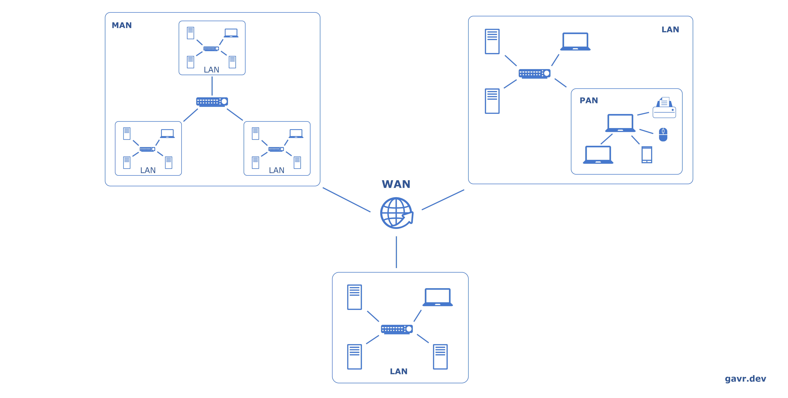
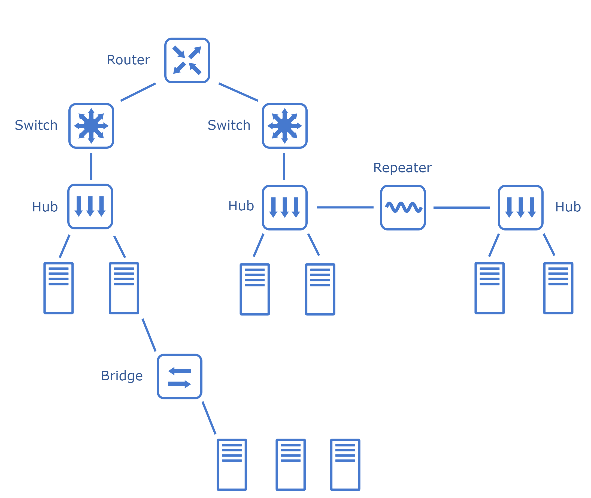
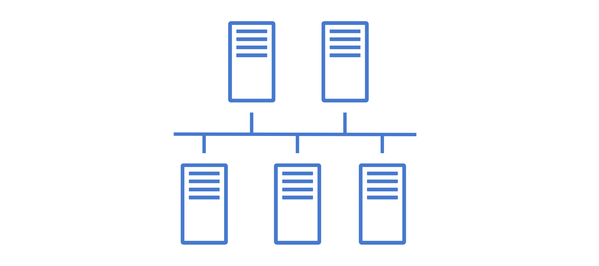
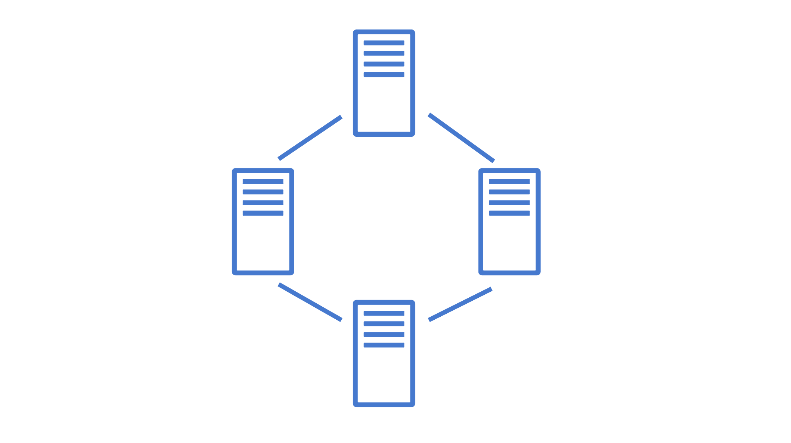
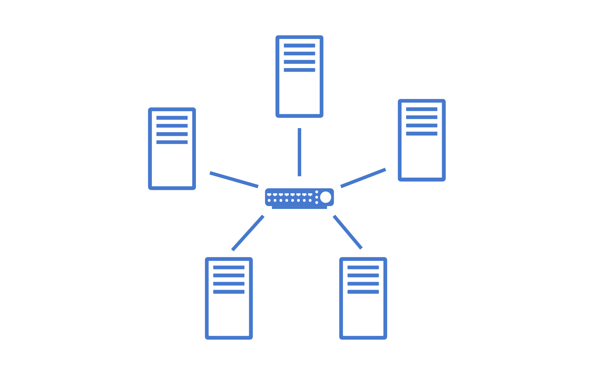
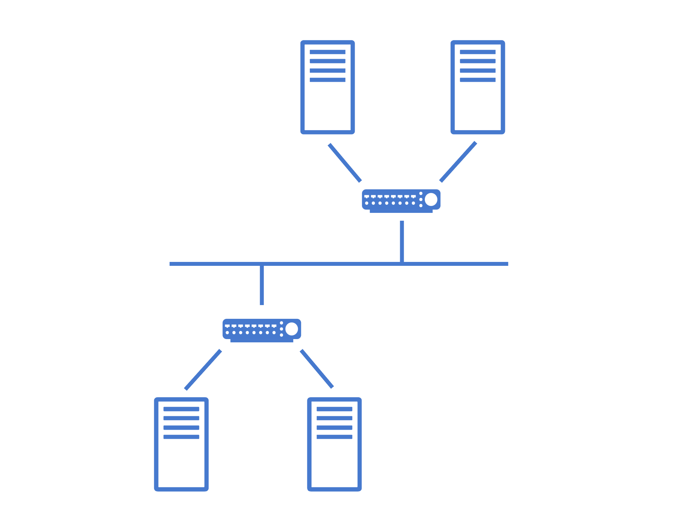
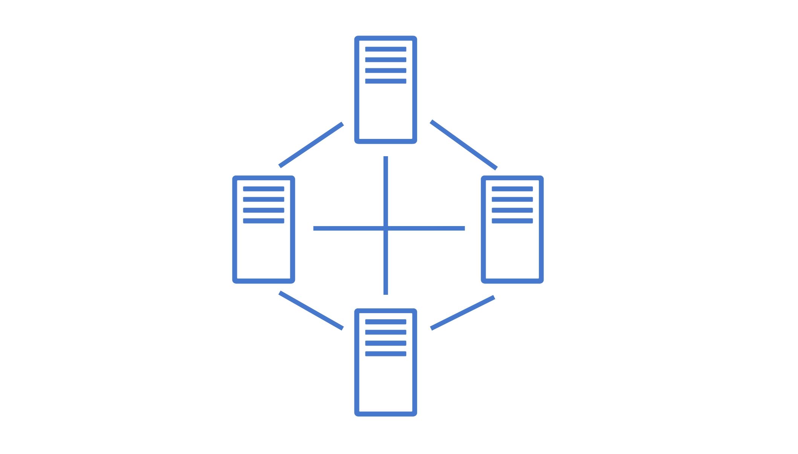
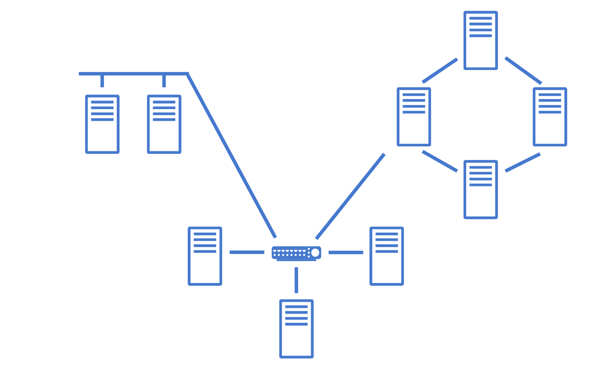

> Navigating the many articles, courses, and videos on systems design can take time and effort. In this tutorial, I briefly cover the main points of systems architecture design. This is a cheat sheet for those preparing for interviews or wanting to brush up on knowledge quickly.

# Networks

Any complex system is a mosaic of numerous components, each with its specific function. These components don't operate in isolation; they constantly interact over a network, exchanging data and commands. Understanding the basics of these interactions is crucial.

One must understand how components communicate over the network to comprehend the system's overall performance and resilience truly.

## Types

Networks can be divided into four types based on size, architecture, range, and function:

- **Personal Area Network (PAN)**: Designed for personal use, usually within a person's range. It might connect devices like a computer, smartphone, and smartwatch, often Bluetooth.
- **Local Area Network (LAN**): Connects devices within a limited area, such as a home, office, or school. It's typically used for connecting computers and sharing resources like printers or internet connections within a confined geographical area.
- **Metropolitan Area Network (MAN):** Covers a larger area than a LAN but is smaller than a WAN, typically spanning a city or a large campus. Local service providers often use it to offer connections to businesses and homes in a town.
- **Wide Area Network (WAN)**: Spans a larger geographical area, often connecting multiple LANs. The internet is the most prominent example of a WAN, linking computers and networks worldwide.

## Components

Building and maintaining networks would be impossible without specialized hardware devices:

- **Cable & Wireless Access Point**: Physical cables (like Ethernet) provide a wired connection between devices, while wireless access points allow devices to connect to the network without physical cables, using Wi-Fi or other wireless technologies.
- **Network Interface Card (NIC)**: These are hardware components, often cards inserted into computers or other devices, that allow them to connect to a network.
- **Repeater**: A network device that amplifies or regenerates a signal, allowing it to travel longer distances without degradation. It's primarily used in wired and wireless networks to extend the range of communication and ensure data integrity over extended distances.
- **Bridge:** A bridge operates at the data link layer. A bridge is a repeater, adding the functionality of filtering content by reading the MAC addresses of the source and destination. It is also used for interconnecting two LANs working on the same protocol.
- **Hub**: These basic networking devices connect multiple devices in a LAN, acting as a single network segment. Hub cannot filter data, so data packets are sent to all connected devices.
- **Switches**: Devices in a network that connect other devices. Unlike hubs, which broadcast the same data to all devices, switches are more intelligent, directing data only to the device that needs it.
- **Routers**: Devices that forward data packets between computer networks. They determine the best path for data transfer. Routers typically connect LANs and WANs and have a dynamically updating routing table based on which they make decisions on routing the data packets.

## Topologies

Network topology is a structural layout that dictates how different network devices and components are connected and how data is transmitted. The choice of topology significantly impacts the network's performance, scalability, and fault tolerance. It is categorized into two main types:

- **Physical**: Describes the physical layout of devices, cables, and other network components. It represents how network devices are physically connected.
- **Logical**: Describes the data flow within the network, regardless of its physical design. It represents how data is transmitted between network devices.

The following types of topologies are distinguished:

### Point-to-Point


A direct connection between two nodes or endpoints. This is the simplest form of network topology.

**Advantages**:
- The direct and dedicated link ensures high-speed data transfer.
- Simple configuration and setup.
- Reliable communication since there are only two nodes involved.


**Disadvantages**:
- It is not scalable for larger networks as it would require a dedicated line for every pair of devices.
- It can be more expensive in scenarios where multiple connections are needed due to the need for individual links.

### Bus



All devices share a single communication line. Data sent by a device is available to all other devices, but only the intended recipient accepts and processes that data.

**Advantages**:
- Easy to implement for small networks.
- Cost-effective due to minimal cabling.

**Disadvantages**:
- Performance degrades as more devices are added or network traffic increases.
- A single cable failure can bring down the entire network.

### Ring


Each device is connected to two other devices, forming a ring. Data travels in one or sometimes two directions.

**Advantages**:
- It can handle larger data loads than bus topology.

**Disadvantages**:
- A failure in one cable or device can take down the entire network.
- More difficult to install and reconfigure.

### Star


All devices are connected to a central device (e.g., a switch or hub).

**Advantages**:
- Easy to install and manage.
- Failure in one cable doesn't affect other devices.

**Disadvantages**:
- If the central device fails, the whole network is inoperable.
- Requires more cable than bus topology.

### Tree


Hybrid topology that combines characteristics of star and bus topologies. Groups of star-configured networks are connected to a linear bus backbone.

**Advantages**:
- Hierarchical and scalable.
- Grouping of devices makes it easy to manage.

**Disadvantages**:
- Failure in the backbone will cause division in the network.
- More cabling is required than other topologies.

### Mesh


Devices are interconnected. Every device is connected to every other device.


**Advantages**:
- Provides high redundancy and reliability.
- Data can be transmitted from multiple devices simultaneously.

**Disadvantages**:
- It requires more cabling, making it expensive.
- Complex to install and configure.

### Hybrid

Combination of two or more topologies.

**Advantages**:
- Flexible and reliable as it inherits the advantages of its component topologies.
- Scalable.

**Disadvantages**:
- Complex design.
- It can be more expensive due to multiple configurations.
## Protocols
Network protocols are rules or standards that define how data is transmitted and received over a network. These protocols ensure that devices on a network (or across multiple networks) can communicate with each other in a standardized way.
### Common Protocols
- **TCP/IP**: The fundamental suite of protocols that powers the Internet. TCP ensures data is sent correctly, and IP provides data is sent to the correct place.
- **UDP**: A connectionless protocol that, unlike TCP, doesn't establish a connection before sending data and doesn't guarantee the order of data packets.
- **HTTP, HTTPS:** Protocols used for transferring web pages on the Internet. HTTPS includes security measures to encrypt data.
- **FTP**: A protocol designed to transfer files over a network.
- **SMTP**: Used for email transmission.
- **IMAP**: Used for retrieving and storing emails from a mail server.
- **POP3**: Used for retrieving emails from a mail server.
- **ICMP**: Used for error reporting and diagnostics related to IP processing.
- **DNS**: Translates domain names to IP addresses, allowing users to access websites using human-readable names.
- **DHCP**: Assigns IP addresses dynamically to devices on a network.
- **SSL/TLS**: Cryptographic protocols are designed to provide secure communication over a computer network.
- **PPP**: Point-to-Point Protocol (PPP) is basically an asymmetric protocol suite for various connections or links without framing.
- **Ethernet**: Defines how devices on a local area network (LAN) communicate. It operates at both the physical layer and the data link layer of the OSI model.

## OSI and TCP/IP Models
The OSI and TCP/IP are two primary models that serve as guiding frameworks that describe the processes involved in data communication over a network.

|      |  OSI Model   |       Protocol       |   Data Format   |   TCP/IP Model    |
| :--: | :----------: | :------------------: | :-------------: | :---------------: |
|  7   | Application  | HTTP, DNS, SMTP, FTP |      Data       |    Application    |
|  6   | Presentation |       TLS, SSL       |      Data       |    Application    |
|  5   |   Session    |       Sockets        |      Data       |    Application    |
|  4   |  Transport   |       TCP, UDP       | Segment, Packet |     Transport     |
|  3   |   Network    |   IP, ICMP, IPsec    |   IP Datagram   |     Internet      |
|  2   |  Data Link   |    PPP, Ethernet     |      Frame      | Network Interface |
|  1   |   Physical   |   Fiber, Wireless    |       Bit       | Network Interface |

The **OSI** (Open Systems Interconnection) model is a conceptual framework for understanding network interactions in seven layers. Each layer serves a specific function:

1. **Physical**: Deals with the physical connection between devices. It defines the hardware elements, such as cables, switches, and NICs.
2. **Data Link**: Responsible for creating a reliable link between two directly connected nodes, handling errors, and regulating data flow.
3. **Network**: Determines the best path to transfer data from the source to the destination across the network.
4. **Transport**: Ensures end-to-end communication, data flow control, and error correction.
5. **Session**: Establishes, maintains, and terminates application connections at both ends.
6. **Presentation**: Translates data between the application and transport layers, ensuring data is readable.
7. **Application**: Directly interacts with end-user applications, ensuring effective communication between software and lower layers of the OSI model.


The **TCP/IP** is a more concise model used predominantly in the modern internet, which simplifies the OSI layers into four categories:

1. **Network Interface**: Combines the functions of OSI's Physical and Data Link layers, focusing on how data is sent/received on a network medium.
2. **Internet**: Corresponds to the Network layer in OSI, handling data routing, IP addressing, and packet forwarding.
3. **Transport**: Similar to OSI's Transport layer, ensuring data reaches the correct application and is transmitted reliably (TCP) or quickly (UDP).
4. **Application**: Merges the functions of OSI's Session, Presentation, and Application layers, dealing with end-user application processes.
## Security
In system design, ensuring robust network security is paramount to protect sensitive data and maintain the trust of users and stakeholders, ensure business continuity, and meet regulatory requirements.
### Common Threats and Vulnerabilities
1. **DDoS Attacks**: Malicious attempts to disrupt the normal traffic of a targeted server, service, or network by overwhelming it with a flood of internet traffic.
2. **Malware**: Software designed to disrupt, damage, or gain unauthorized access to a computer system. This includes viruses, worms, spyware, and ransomware.
3. **Man-in-the-Middle Attacks**: Attackers secretly intercept and relay communication between two parties. They can eavesdrop or impersonate one of the parties, deceiving the other.
4. **Insider Threats**: Threats originating from within the organization, such as employees, former employees, or partners with inside information concerning security practices.
5. **Software Flaws**: Bugs or weaknesses in software can be exploited to gain unauthorized access or disrupt services. Examples include buffer overflows and unhandled exceptions.
6. **Hardware Weaknesses**: Physical components can have vulnerabilities, like firmware that can be tampered with or backdoors installed by manufacturers.
7. **Misconfigured Network Devices**: Devices like routers, switches, or firewalls that are not correctly configured can expose the network to various threats.
8. **Weak Authentication and Authorization**: Insufficient password policies, lack of multi-factor authentication, or lax access controls can allow unauthorized access.
9. **Unencrypted Data**: Data that isn't encrypted can be easily intercepted and read as it travels across a network.
10. **Outdated Systems**: Systems that are no longer supported or haven't been updated can have known vulnerabilities that are easy to exploit.
11. **Physical Vulnerabilities**: This refers to physical access points where an attacker could plug into the network or access servers directly.
### Best Practices for Ensuring Network Security
1. **Firewalls**: Deploy hardware and software firewalls to monitor and control incoming and outgoing network traffic based on security policies.
2. **Encryption**: Use encryption protocols, especially for sensitive data, both in transit (like SSL/TLS for web traffic) and at rest (like database encryption).
3. **Regular Updates**: Keep all systems, software, and applications updated to patch vulnerabilities.
4. **Multi-Factor Authentication (MFA)**: Implement MFA to add a layer of security, ensuring that users provide two or more verification factors to gain access.
5. **Network Monitoring**: Use network monitoring tools to monitor the network for unusual activities or unauthorized access continuously.
6. **Security Awareness Training**: Educate employees and users about the importance of security and how to recognize potential threats.
7. **Network Segmentation**: Limits the spread of threats within the network and provides better control over data access.
8. **Backup and Disaster Recovery**: Ensures data availability and business continuity in case of breaches or failures.
9. **Physical Security**: Physical access to network devices can lead to breaches.

# API Architecture Styles
API architecture refers to the set of rules, protocols, and tools that dictate how software components should interact. The architecture of an API is not just about facilitating communication; it's also about ensuring that this communication is efficient, secure, and scalable.
A well-designed API architecture can significantly enhance the performance of a system, while a poorly designed one can lead to bottlenecks, security vulnerabilities, and maintenance nightmares.
## Different Styles of API Architecture


The most common API design styles:

1. **REST** (Representational State Transfer) is the most used style that uses standard methods and HTTP protocols. It's based on principles like statelessness, client-server architecture, and cacheability. It's often used between front-end clients and back-end services.
2. **GraphQL** is a query language for APIs. Unlike REST, which exposes a fixed set of endpoints for each resource, GraphQL allows clients to request exactly the data they need, reducing over-fetching.
3. **WebSocket** is a protocol allowing two-way communication over TCP. Clients use web sockets to get real-time updates from back-end systems.
4. **Webhook** is a mechanism that allows one system to notify another system about specific events in real-time. It is a user-defined HTTP callback.
5. **RPC (gRPC)** is a protocol that one service can use to request a procedure/method from a service located on another computer in a network. Usually, It's designed for low-latency, high-speed communication.
6. **SOAP** is a protocol for exchanging structured information to implement web services. It relies on XML and is known for its robustness and security features, currently considered a legacy protocol.

Let's look at each protocol separately with all their pros, cons, and use cases.

## REST
<p align="center">

</p>

**REST** is an architectural style that uses standard conventions and protocols, making it easy to understand and implement. Its stateless nature and use of standard HTTP methods make it a popular choice for building web-based APIs.

While REST has been the de facto standard for building APIs for a long time, other styles like GraphQL have emerged, offering different paradigms for querying and manipulating data.

**Format**: XML, JSON, HTML, plain text

**Transport protocol**: HTTP/HTTPS

### **Key Concepts and Characteristics**

- **Resource**: In REST, everything is a resource. A resource is an object with a type, associated data, relationships to other resources, and a set of methods that operate on it. Resources are identified by their URIs (typically a URL).
- **CRUD Operations**: REST services often map directly to CRUD (Create, Read, Update, Delete) operations on resources.
- **HTTP Methods**: REST systems use standard HTTP methods:
  - GET: Retrieve a resource.
  - POST: Create a new resource.
  - PUT/PATCH: Update an existing resource.
  - DELETE: Remove a resource.
- **Status Codes**: REST APIs use standard HTTP status codes to indicate the success or failure of an API request:
  - 2xx - Acknowledge and Success
    - 200 - OK
    - 201 - Created
    - 202 - Accepted
  - 3xx - Redirection
    - 301 - Moved Permanently
    - 302 - Found
    - 303 - See Other
  - 4xx - Client Error
    - 400 - Bad Request
    - 401 - Unauthorized
    - 403 - Forbidden
    - 404 - Not Found
    - 405 - Method Not Allowed
  - 5xx - Server Error
    - 500 - Internal Server Error
    - 501 - Not Implemented
    - 502 - Bad Gateway
    - 503 - Service Unavailable
    - 504 - Gateway Timeout
- **Stateless**: Each request from a client to a server must contain all the information needed to understand and process the request. The server should not store anything about the client's state between requests.
- **Client-Server**: REST is based on the client-server model. The client is responsible for the user interface and experience, while the server is responsible for processing requests, handling business logic, and storing data.
- **Cacheable**: Responses from the server can be cached by the client. The server must indicate whether a response is cacheable or not.
- **Layered System**: A client cannot ordinarily tell whether it is connected directly to the end server or an intermediary. Intermediary servers can improve system scalability by enabling load balancing and providing shared caches.
- **HATEOAS:** Hypermedia As The Engine Of Application Stat is a REST web service principle that enables clients to interact with and navigate through a web application entirely based on the hypermedia provided dynamically by the server in its responses, promoting loose coupling and discoverability.

### Use Cases

- **Web Services**: Many web services expose their functionality via REST APIs, allowing third-party developers to integrate and extend their services.

- **Mobile Applications**: Mobile apps often communicate with backend servers using REST APIs to fetch and send data.

- **Single Page Applications (SPAs)**: SPAs use REST APIs to dynamically load content without requiring a full page refresh.

- **Integration Between Systems:** Systems within an organization can communicate and share data using REST APIs.

### Example

**Request**

GET “/user/42”

**Response**

```json
{
    "id": 42,
    "name": "Alex",
	"links": {
        "role": "/user/42/role"
    }
}
```

## GraphQL
<p align="center">

</p>

**GraphQL** offers a more flexible, robust, and efficient approach to building APIs, especially in complex systems or when the frontend needs high flexibility. It shifts some of the responsibility from the server to the client, allowing the client to specify its data requirements.

While it's not a replacement for REST in all scenarios, it offers a compelling alternative in many situations, particularly as applications become more networked and distributed.

**Format**: JSON

**Transport protocol**: HTTP/HTTPS

### Key Concepts and Characteristics

- **Query Language for APIs**: It allows clients to request the data they need, making it possible to get all required information in a single request.

- **Type System**: GraphQL APIs are organized in terms of types and fields, not endpoints. It uses a strong type system to define the capabilities of an API. All the types exposed in an API are written down in a schema using the GraphQL Schema Definition Language (SDL).

- **Single Endpoint**: Unlike REST, where you might have multiple endpoints for different resources, in GraphQL, you typically expose a single endpoint that expresses the complete set of capabilities of the service.

- **Resolvers**: On the server side, resolvers gather the data described in a query.

- **Real-time Updates with Subscriptions**: Beyond just querying data, GraphQL includes built-in support for real-time updates using subscriptions.

- **Introspective**: A GraphQL server can be queried for the types it supports. This creates a strong contract between client and server, allowing for tooling and better validation.

### Use Cases

- **Flexible Frontends**: For applications (especially mobile) with crucial bandwidth, you want to minimize the data fetched from the server.

- **Aggregating Microservices**: A GraphQL layer can be introduced to aggregate the data from these services into a unified API if you have multiple microservices.

- **Real-time Applications**: With its subscription system, GraphQL can be an excellent fit for applications that need real-time data, like chat applications, live sports updates, etc.

- **Version-Free APIs**: With REST, you often need to version your APIs once changes are introduced. With GraphQL, clients only request the data required, so adding new fields or types doesn't create breaking changes.

### Example

**Request**

GET “/graphql?query=user(id:42){ name role { id name } }”

**Response**

```json
{
    "data": {
        "user": {
            "id": 42,
            "name": "Alex",
            "role": {
                "id": 1,
                "name": "admin"
            }
        }
    }
}
```

## WebSocket
<p align="center">

</p>

**WebSockets** provide a full-duplex communication channel over a single, long-lived connection, allowing real-time data exchange between a client and a server. This makes it ideal for interactive and high-performance web applications.

**Format**: Binary

**Transport protocol**: TCP

### Key Concepts and Characteristics

- **Persistent Connection**: Unlike the traditional request-response model, WebSockets provide a full-duplex communication channel that remains open, allowing for real-time data exchange.

- **Upgrade Handshake**: WebSockets start as an HTTP request, which is then upgraded to a WebSocket connection if the server supports it. This is done via the `Upgrade` header.

- **Frames**: Once the connection is established, data is transmitted as frames. Both text and binary data can be sent through these frames.

- **Low Latency**: WebSockets allow for direct communication between the client and server without the overhead of opening a new connection for each exchange. This results in faster data exchange.

- **Bidirectional**: Both the client and server can send messages to each other independently.

- **Less Overhead**: After the initial connection, data frames require fewer bytes to send, leading to less overhead and better performance than repeatedly establishing HTTP connections.

- **Protocols and Extensions**: WebSockets support subprotocols and extensions, allowing for standardized and custom protocols on top of the base WebSocket protocol.

### Use Cases

- **Online Gaming**: Real-time multiplayer games where players' actions must be immediately reflected to other players.

- **Collaborative Tools**: Applications like Google Docs, where multiple users can edit a document simultaneously and see each other's changes in real-time.

- **Financial Applications**: Stock trading platforms where stock prices need to be updated in real-time.

- **Notifications**: Any application where users need to receive real-time notifications, such as social media platforms or messaging apps.

- **Live Feeds**: News websites or social media platforms where new posts or updates are streamed live to users.

### Example

**Request**

GET “ws://site:8181”

**Response**

HTTP/1.1 101 Switching Protocols

## Webhook

<p align="center">

</p>

**Webhook** is a user-defined HTTP callback triggered by specific web application events, allowing real-time data updates and integrations between different systems.

**Format**: XML, JSON, plain text

**Transport protocol**: HTTP/HTTPS

### Key Concepts and Characteristics

- **Event-Driven**: Webhooks are typically used to denote that an event has occurred. Instead of requesting data at regular intervals, webhooks provide data as it happens, turning the traditional request-response model on its head.

- **Callback Mechanism**: Webhooks are essentially a user-defined callback mechanism. When a specific event occurs, the source site makes an HTTP callback to the URI provided by the target site, which will then take a specific action.

- **Payload**: When the webhook is triggered, the source site will send data (payload) to the target site. This data is typically in the form of JSON or XML.

- **Real-time**: Webhooks allow applications to get real-time data, making them highly responsive.

- **Customizable**: Users or developers can typically define what specific events they want to be notified about.

- **Security**: Since webhooks involve making callbacks to user-defined HTTP endpoints, they can pose security challenges. It's crucial to ensure that the endpoint is secure, the data is validated, and possibly encrypted.

### Use Cases

- **Continuous Integration and Deployment (CI/CD)**: Triggering builds and deployments when code is pushed, or a pull request is merged.

- **Content Management Systems (CMS)**: Notifying downstream systems when content is updated, published, or deleted.

- **Payment Gateways**: Informing e-commerce platforms about transaction outcomes, such as successful payments, failed transactions, or refunds.

- **Social Media Integrations**: Receiving notifications about new posts, mentions, or other relevant events on social media platforms.

- **IoT (Internet of Things)**: Devices or sensors can trigger webhooks to notify other systems or services about specific events or data readings.

### Example

**Request**

GET “[https://external-site/webhooks?url=http://site/service-h/api&name=name](https://external-site/webhooks?url=http%3A%2F%2Fsite%2Fservice-h%2Fapi&name=name&ref=hackernoon.com)”

**Response**

```json
{
  "webhook_id": 12
}
```

## RPC and gRPC
<p align="center">

</p>

**RPC** (Remote Procedure Call) is a protocol that allows a program to execute a procedure or subroutine in another address space, enabling seamless communication and data exchange between distributed systems.

**gRPC** (Google RPC) is a modern, open-source framework built on top of RPC that uses HTTP/2 for transport and Protocol Buffers as the interface description language, providing features like authentication, load balancing, and more to facilitate efficient and robust communication between microservices.

### **RPC**

**Format**: JSON, XML, Protobuf, Thrift, FlatBuffers

**Transport protocol**: Various

#### Key Concepts and Characteristics

- **Definition**: RPC allows a program to cause a procedure (subroutine) to execute in another address space (commonly on another computer on a shared network). It's like calling a function performed on a different machine than the caller's.

- **Stubs**: In the context of RPC, stubs are pieces of code generated by tools that allow local and remote procedure calls to appear the same. The client has a stub that looks like the remote procedure, and the server has a stub that unpacks arguments, calls the actual procedure, and then packs the results to send back.

- **Synchronous by default**: Traditional RPC calls are blocking, meaning the client sends a request to the server and gets blocked waiting for a response from the server.

- **Language Neutral**: Many RPC systems allow different client and server implementations to communicate regardless of the language they're written in.

- **Tight Coupling**: RPC often requires the client and server to know the procedure being called, its parameters, and its return type.

#### Use Cases

- **Distributed Systems**: RPC is commonly used in distributed systems where parts of a system are spread across different machines or networks but need to communicate as if they're local.

- **Network File Systems**: NFS (Network File System) is an example of RPCs performing file operations remotely.

#### Example

**Request**

```json
{
    "method": "addUser",
    "params": [
        "Alex"
    ]
}
```

**Response**

```json
{    
    "id": 42,
    "name": "Alex",
	"error": null
}
```

### gRPC

**Format**: Protobuf

**Transport protocol**: HTTP/2

#### Key Concepts and Characteristics

- **Definition**: gRPC is an open-source RPC framework developed by Google. It uses HTTP/2 for transport, Protocol Buffers (Protobuf) as the interface description language, and provides authentication, load balancing features, and more.

- **Protocol Buffers**: This is a language-neutral, platform-neutral, extensible mechanism for serializing structured data. With gRPC, you define service methods and message types using Protobuf.

- **Performance**: gRPC is designed for low latency and high throughput communication. HTTP/2 allows for multiplexing multiple calls over a single connection and reduces overhead.

- **Streaming**: gRPC supports streaming requests and responses, allowing for more complex use cases like long-lived connections, real-time updates, etc.

- **Deadlines/Timeouts**: gRPC allows clients to specify how long they will wait for an RPC to complete. The server can check this and decide whether to complete the operation or abort if it will likely take too long.

- **Pluggable**: gRPC is designed to support pluggable authentication, load balancing, retries, etc.

- **Language Neutral**: Like RPC, gRPC is language agnostic. However, with Protobuf and the gRPC tooling, generating client and server code in multiple languages is easy.

#### Use Cases

- **Microservices**: gRPC is commonly used in microservices architectures due to its performance characteristics and ability to define service contracts easily.

- **Real-time Applications**: Given its support for streaming, gRPC is suitable for real-time applications where servers push data to clients in real-time.

- **Mobile Clients**: gRPC's performance benefits and streaming capabilities make it a good fit for mobile clients communicating with backend services.

#### Example

```
message User {
  int id = 1
  string name = 2
}

service UserService {
  rpc AddUser(User) returns (User);
}
```

## SOAP
<p align="center">

</p>

**SOAP**, which stands for Simple Object Access Protocol, is a protocol for exchanging structured information to implement web services in computer networks. It's an XML-based protocol that allows programs running on disparate operating systems to communicate with each other.

**Format**: XML

**Transport protocol**: HTTP/HTTPS, JMS, SMTP, and more

### Key Concepts and Characteristics

- **XML-Based**: SOAP messages are formatted in XML and contain the following elements:

  - **Envelope**: The root element of a SOAP message that defines the XML document as a SOAP message.

  - **Header**: Contains any optional attributes of the message used in processing the message, either at an intermediary point or the ultimate end-point.

  - **Body**: Contains the XML data comprising the message being sent.

  - **Fault**: An optional Fault element that provides information about errors while processing the message.

- **Neutrality**: SOAP can be used with any programming model and is not tied to a specific one.

- **Independence**: It can run on any operating system and in any language.

- **Stateless**: Each request from a client to a server must contain all the information needed to understand and process the request.

- **Built-in Error Handling**: The Fault element in a SOAP message is used for error reporting.

- **Standardized**: Operates based on well-defined standards, including the SOAP specification itself, as well as related standards like WS-ReliableMessaging for ensuring message delivery, WS-Security for message security, and more.

### Use Cases

- **Enterprise Applications**: SOAP is often used in enterprise settings due to its robustness, extensibility, and ability to traverse firewalls and proxies.

- **Web Services**: Many web services, especially older ones, use SOAP. This includes services offered by major companies like Microsoft and IBM.

- **Financial Transactions**: SOAP's built-in security and extensibility make it a good choice for financial transactions, where data integrity and security are paramount.

- **Telecommunications**: Telecom companies might use SOAP for processes like billing, where different systems must communicate reliably.

### Example

**Request**

```markup
<?xml version="1.0"?>
<soap:Envelope>
	<soap:Body>
		<m:AddUserRequest>
			<m:Name>Alex</m:Name>
		</m:AddUserRequest>
	</soap:Body>
</soap:Envelope>
```

**Response**

```markup
<?xml version="1.0"?>
<soap:Envelope>
	<soap:Body>
		<m:AddUserResponse>
			<m:Id>42</m:Id>
			<m:Name>Alex</m:Name>
		</m:AddUserResponse>
	</soap:Body>
</soap:Envelope>
```

# Balancer, Proxy, Gateway
<p align="center">

</p>

Load Balancers, Reverse Proxies, Forward Proxies, and API Gateways are all network tools that manage traffic between clients and servers, but they serve different purposes and have unique features.

## Load Balancers

A **load balancer** is a specialized network device or software application designed to optimize the distribution of incoming network traffic across multiple servers or resources. Its primary role is to enhance the performance, availability, and reliability of applications and services by preventing any single server from becoming a bottleneck. Load balancers achieve this by employing various algorithms to route incoming requests to the most appropriate server intelligently.

Load balancers come in two main types:

- **Hardware** load balancers are dedicated physical devices optimized for high-speed data processing. They are often used in enterprise settings where performance and reliability are critical.
- **Software** load balancers, on the other hand, are more flexible and can be deployed on virtual machines or containers. They offer the advantage of being easily scalable and configurable, making them suitable for cloud-based and dynamic environments.

It's also important to note that the role of a load balancer is not limited to just distributing traffic between clients and servers. Load balancers can also be used within a data center to balance traffic between different components of an application, such as microservices. They can even be deployed to distribute workloads across multiple databases, cache servers, or other backend services. This makes them versatile tools in various network architectures beyond the traditional client-server model.

To protect against failures, it's common to set up multiple load balancers in active-passive or active-active mode or build a hierarchy of balancers.

> If setting up a complete load balancer between client and server isn't possible, load balancing can be managed on the client side. The client application receives a list of available web or application servers and initially connects to the first one to request data. Should that server repeatedly fail after a predetermined number of retries, the application discards it and moves on to the next server on the list. This approach offers a cost-effective way to implement load balancing.

### Types of Load Balancers

Based on specific needs, load balancing can be performed at the network/transport and application layer of the OSI layers:

- **Layer 4** - Operate at the Transport layer of the OSI model, dealing primarily with TCP and UDP packets. This load balancers route traffic based on source and destination IP addresses and ports. They are relatively simple, fast, and effective for routing user requests to available servers without inspecting the content of the packets. Used when needed:
  - High-speed data routing
  - Simple load distribution based on IP and port
- **Layer 7** - Operate at the Application layer and can inspect the data packets' content. This allows them to make more intelligent routing decisions based on HTTP headers, cookies, or application-specific data. Used when needed:
  - Content-based routing
  - SSL termination
  - Application-level decisions like directing users to a specific version of a web page
- **Layer 2/3** - Though less common, some load balancers operate at the Data Link (Layer 2) and Network (Layer 3) levels. These load balancers are generally used in specialized scenarios requiring packet-level routing. Used when needed:
  - MAC address-based routing (Layer 2)
  - IP-based routing without port considerations (Layer 3)

### Global and Local Load Balancers

Load balancing can be categorized into local and global types, each serving different scopes and use cases. Local load balancing operates within a single data center or cloud region, focusing on distributing traffic among servers in that specific location. On the other hand, global load balancing works across multiple data centers or cloud regions, often on a worldwide scale. It routes users to the nearest or best-performing data center.

#### Global Server Load Balancers (GSLB)
<p align="center">

</p>
**GSLB**, or Global Server Load Balancing, is designed to distribute user traffic across multiple geographically dispersed data centers. Its primary purpose is to optimize user experience by reducing latency and enhancing fault tolerance. GSLB is primarily based on the Domain Name System (DNS). When a DNS query comes in for a particular domain, the GSLB-enabled DNS server doesn't just return a pre-configured IP address. Instead, it evaluates various metrics such as the geographic proximity of the user to the data centers, the health and load of the servers in those data centers, and even performance metrics like latency and packet loss. Based on these factors, the DNS server returns the IP address of the most suitable data center. This ensures that users are always directed to the optimal server, improving performance and availability.

The most common balancing use cases are:

- **DNS round-robin**: Distributes traffic between all data centers in multiple locations.
- **Failover**: Send all traffic to a primary data center, but redirect traffic to a secondary data center if the primary becomes inaccessible.
- **Geolocation-based DNS**: Detect users' locations and route traffic to the nearest data center to lower latency.


GSLB provides:

- **Disaster recovery**: Automatically reroute user traffic to an operational data center if another experiences an outage or failure.
- **Better user experience**: Route clients to the nearest data center.
- **Meet regulatory and security requirements**: Route user traffic to data centers that comply with specific legal and security standards, such as data sovereignty or GDPR.
- **Caching and Content Delivery**: Allows to get a cache of data and static content (pictures, videos) from the servers closest to the user.


**Popular Solutions**: F5 BIG-IP DNS, Citrix ADC, AWS Route 53, Cloudflare Load Balancer

#### Local Load Balancers
<p align="center">

</p>
A **Local Load Balancer** operates within a single data center or cloud region, primarily focusing on distributing incoming traffic among local servers. Its main goal is to optimize resource utilization, maximize throughput, and minimize response time. It works to intelligently route incoming requests to the most appropriate server within the local network. Doing so enhances the performance and reliability of applications and services within that specific location.

Local Load Balancer provides:

- **Traffic distribution**: Ability to direct incoming requests to specific backend servers based on specific rules.

- **Load Balancing**: Distributing incoming traffic across multiple servers to optimize resource utilization.

- **Failower**: Automatically directing traffic away from servers that are down or underperforming to maintain service availability.

- **Traffic Pattern Prediction**: Ability to forecast traffic patterns using analytics or historical traffic data.

- **Seamless Scaling**: Easily adding more servers to the server farm to handle increased traffic.

  

**Popular Solutions**: HAProxy, NGINX Load Balancer, AWS Elastic Load Balancer (ELB), F5 BIG-IP Local Traffic Manager (LTM)

### Load-balancing algorithms

The choice of a load-balancing algorithm depends on the specific needs and objectives of the application or service being balanced. Different algorithms offer various advantages and trade-offs, making them more or less suitable for particular scenarios.

#### Static Algorithms

 

Distributes incoming requests sequentially and evenly across all available servers cyclically.


       


A hybrid approach that combines Round Robin distribution with session persistence, ensuring that once a user session is established, it remains on the assigned server.


  


Similar to Round Robin, each server is assigned a weighted score, affecting the distribution of requests. Servers with higher weights receive a larger share of the incoming requests.


 


This algorithm hashes the client's IP address to determine the server for routing the request, ensuring session persistence by always directing a specific client's requests to the same server.


#### Dynamic Algorithms

   


​    Requests are redirected to the server with the fastest average response time, balancing server load and user experience.


 


​    Requests are redirected to the server with the fewest active connections, requiring additional computation by the load balancer to identify less-busy servers.


## Reverse Proxy
<p align="center">

</p>

A **Reverse Proxy**, like a Load Balancer, is a server that sits between clients and a web server, directing incoming requests to appropriate backend servers. The key difference between a reverse proxy and a load balancer is their primary focus. While both can distribute traffic across multiple servers, a load balancer is designed explicitly for this purpose and usually offers more advanced distribution algorithms. A reverse proxy, on the other hand, provides a broader range of functionalities, such as:

- **Backend Anonymity**: Backend servers remain hidden from the external network, protecting against potential vulnerabilities.

- **DDoS Mitigation**: Many reverse proxies have built-in features to shield backend servers from distributed denial-of-service attacks, such as IP deny listing and client connection rate limiting.

- **SSL Offloading**: Handles the decryption of incoming requests and encryption of server responses, relieving backend servers from these computationally intensive tasks.

- **Data Compression**: Reduces the size of server responses for faster data transfer.

- **Response Caching**: Serves previously cached responses to identical requests, improving speed and reducing server load.

- **Direct Serving of Static Content**: Manages the delivery of static files like HTML, CSS, JavaScript, images, and videos directly to the client.

- **URL/Content Rewriting**: Modifies the URL or content before forwarding requests to the backend servers.

Reverse proxies can be helpful even with just one web server or application server, opening up the benefits described in the previous section.


**Popular Solutions**: Nginx, Apache HTTP Server (mod_proxy), HAProxy, Squid, Azure Application Gateway

## Forward Proxy
<p align="center">

</p>

A **Forward Proxy** is a server that sits between client devices and the Internet, acting as an intermediary for outgoing requests from the client. A forward proxy accepts connections from computers on a private network and forwards those requests to the public internet. It is the single exit point for subnet users accessing resources outside their private network. The key difference between a forward proxy and a reverse proxy lies in their primary roles and whom they serve. A forward proxy primarily serves the client's needs, helping it access blocked or restricted content and providing anonymity. A reverse proxy, on the other hand, is installed on the server side and manages incoming requests to the server. A forward proxy is client-focused and provides functions like:

- **Clients Anonymity**: A forward proxy conceals the client's original IP address, adding an extra layer of security during internet access.

- **Access Management**: Organizations can employ forward proxies to limit access to specific resources, safeguarding sensitive information.

- **Caching**: By caching commonly accessed resources, forward proxies can enhance client internet response times.

- **Traffic Control**: Forward proxies can manage and control network traffic flow, optimizing bandwidth usage.

- **Logging**: Forward proxies can record all outgoing requests and responses, aiding in monitoring and auditing.

  

**Popular Solutions**: Squid, Tinyproxy, CCProxy, WinGate

## API Gateway
<p align="center">

</p>

An **API Gateway** is a centralized entry point that manages and routes API requests from client applications to appropriate backend services. It acts as a layer of abstraction between the client and multiple backend services, streamlining their interaction. It is a crucial component in modern architecture, especially in microservices-based systems. API gateways offer various functionalities like:

- **Routing**: Directs client-originating API requests to the suitable backend service or microservice, guided by established rules and settings.
- **Authentication and Authorization**: Manages user credentials to ensure only approved clients can access services. This includes verification of API keys, tokens, or other forms of identification.
- **Rate Limiting and Throttling**: Safeguards backend services by enforcing client request rate limits or throttling based on pre-configured policies.
- **Load Balancing**: Distributes incoming API requests across multiple service instances, enhancing the system's ability to manage a higher volume of requests and improving overall performance.
- **Caching**: Minimizes latency and backend workload by storing and reusing frequently requested responses, bypassing the need for backend queries.
- **Request and Response Transformation**: Alters incoming and outgoing data, such as data format conversions or header modifications, to maintain compatibility between clients and backend services.
- **Monitoring**: Gathers metrics and other relevant data on request and response behaviors, offering insights into microservice performance and aiding in problem identification and resolution.
- **Request and Response Validation**: Validates the structure and format of requests and responses to and from microservices, helping to prevent errors and ensure proper functionality.
- **Circuit Breaking**: Implements a circuit breaker pattern to prevent a single service failure from compromising the entire system. It monitors service health and can switch to a backup service if needed.
- **Service Discovery**: Identifies available microservices and their locations, allowing clients to interact with them without knowing their specific addresses.
- **Enhanced Security**: Enforces robust authentication and access control measures, bolstering the system's overall security against unauthorized access.


**Popular Solutions**: Kong, Amazon API Gateway, Apigee, Azure API Gateway, MuleSoft Anypoint Platform

## Conclusion

In the complex landscape of network architecture and web services, understanding the roles and functionalities of Load Balancers, Forward Proxies, Reverse Proxies, and API Gateways is crucial for effective system design and management. While each of these components serves a unique purpose, they all aim to optimize resource utilization, enhance security, and improve user experience in some form.

**Load Balancers** primarily focus on distributing incoming traffic across multiple servers to ensure no single server is overwhelmed. They are essential for scalability and high availability but are generally agnostic to the type of content being served.

**Reverse Proxies** sit in front of web servers and direct client requests to the appropriate backend server. They are server-facing and are often used for caching, SSL termination, and load distribution within an internal network.

**Forward Proxies** act as intermediaries between clients and servers, often filtering requests, providing anonymity for users, or bypassing geo-restrictions. They are client-facing and are generally used to control outbound traffic.

**API Gateways**, on the other hand, are specialized types of reverse proxies tailored for API traffic. They offer advanced functionalities like request routing, API composition, rate limiting, and security features such as authentication and authorization.

Each component has advantages and limitations, and your project's specific needs and constraints should dictate the choice between them. In many modern architectures, you'll often find a combination of these elements working to create a robust, scalable, and secure environment. Understanding their distinct roles and capabilities is the first step in making an informed decision about which to implement in your system.
