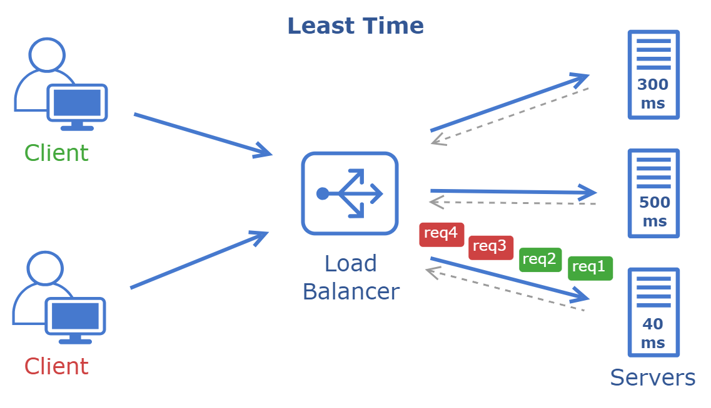
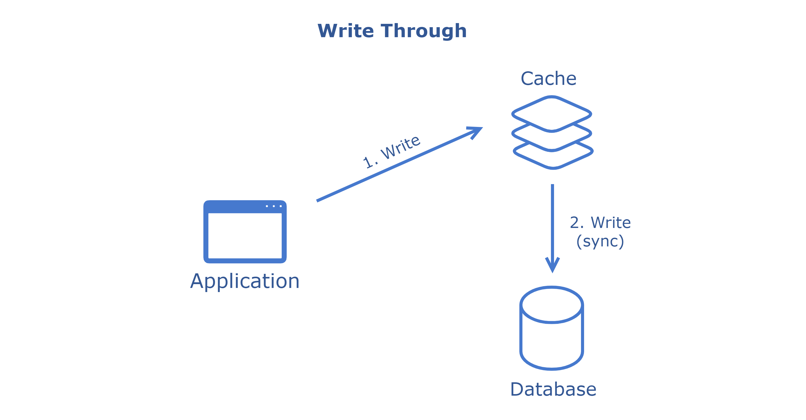
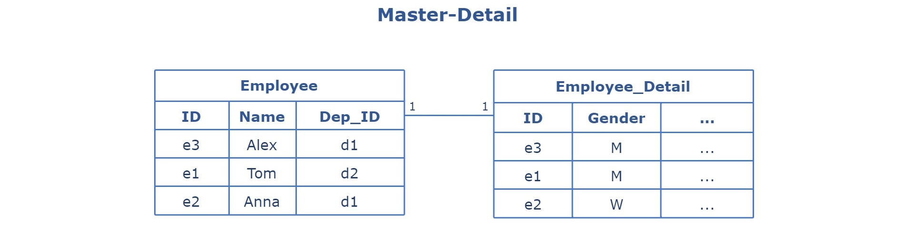

<h1 align="center">The System Design Cheat Sheet</h1>
<p align="center">

<a href="" alt="Tag"></a>
<a href="https://hackernoon.com/u/gavr" target="_blank" alt="Articles"></a>
<a href="https://github.com/gavr-dev/system-design-cheat-sheet/blob/main/LICENSE" alt="GPLv3 licensed"></a>
</p>

> Navigating the many articles, courses, and videos on systems design can take time and effort. In this tutorial, I briefly cover the main points of systems architecture design. This is a cheat sheet for those preparing for interviews or wanting to brush up on knowledge quickly.

# Table of Contents
- [Networks](#networks)
	- [Types](#types)
	- [Components](#components)
	- [Topologies](#topologies)
	- [Protocols](#protocols)
	- [OSI and TCP/IP Models](#osi-and-tcpip-models)
	- [Security](#security)
- [API Architecture Styles](#api-architecture-styles)
	- [Different Styles of API Architecture](#different-styles-of-api-architecture)
	- [REST](#rest)
	- [GraphQL](#graphql)
	- [WebSocket](#websocket)
	- [Webhook](#webhook)
	- [RPC and gRPC](#rpc-and-grpc)
	- [SOAP](#soap)
- [Balancer, Proxy, Gateway](#balancer-proxy-gateway)
	- [Load Balancers](#load-balancers)
	- [Reverse Proxy](#reverse-proxy)
	- [Forward Proxy](#forward-proxy)
	- [API Gateway](#api-gateway)
	- [Conclusion](#conclusion)
- [Cache](#cache)
	- [Types of Caching](#types-of-caching)
	- [Top caching strategies](#top-caching-strategies)
	- [Cache eviction policies](#cache-eviction-policies)
	- [Cache invalidation](#cache-invalidation)
	- [Popular Solutions](#popular-solutions)
- [Message Queues](#message-queues)
	- [Components](#components)
	- [Messaging Models](#messaging-models)
	- [Protocols](#protocols)
		- [AMQP](#amqp-advanced-message-queuing-protocol)
		- [MQTT](#mqtt-message-queuing-telemetry-transport)
		- [JMS](#jms-java-message-service)
		- [STOMP](#stomp-simple-text-oriented-messaging-protocol)
		- [Kafka Protocol](#kafka-protocol)
		- [ZMTP](#zmtp-zeromq-message-transport-protocol)
	- [Brokers](#brokers)
		- [ActiveMQ](#activemq)
		- [RabbitMQ](#rabbitmq)
		- [Kafka](#kafka)
		- [ZeroMQ](#zeromq)
- [RDBMS](#rdbms)
	- [Terminology](#terminology)
	- [Database Design Strategies](#database-design-strategies)
	- [ER (Entity Relationship) Diagram](#er-entity-relationship-diagram)
	- [Design Patterns](#design-patterns)
	- [Scaling and Fault Tolerance](#scaling-and-fault-tolerance)

# Networks
Any complex system is a mosaic of numerous components, each with its specific function. These components don't operate in isolation; they constantly interact over a network, exchanging data and commands. Understanding the basics of these interactions is crucial.
One must understand how components communicate over the network to comprehend the system's overall performance and resilience truly.

## Types

Networks can be divided into four types based on size, architecture, range, and function:

- **Personal Area Network (PAN)**: Designed for personal use, usually within a person's range. It might connect devices like a computer, smartphone, and smartwatch, often Bluetooth.
- **Local Area Network (LAN**): Connects devices within a limited area, such as a home, office, or school. It's typically used for connecting computers and sharing resources like printers or internet connections within a confined geographical area.
- **Metropolitan Area Network (MAN):** Covers a larger area than a LAN but is smaller than a WAN, typically spanning a city or a large campus. Local service providers often use it to offer connections to businesses and homes in a town.
- **Wide Area Network (WAN)**: Spans a larger geographical area, often connecting multiple LANs. The internet is the most prominent example of a WAN, linking computers and networks worldwide.

## Components

Building and maintaining networks would be impossible without specialized hardware devices:

- **Cable & Wireless Access Point**: Physical cables (like Ethernet) provide a wired connection between devices, while wireless access points allow devices to connect to the network without physical cables, using Wi-Fi or other wireless technologies.
- **Network Interface Card (NIC)**: These are hardware components, often cards inserted into computers or other devices, that allow them to connect to a network.
- **Repeater**: A network device that amplifies or regenerates a signal, allowing it to travel longer distances without degradation. It's primarily used in wired and wireless networks to extend the range of communication and ensure data integrity over extended distances.
- **Bridge:** A bridge operates at the data link layer. A bridge is a repeater, adding the functionality of filtering content by reading the MAC addresses of the source and destination. It is also used for interconnecting two LANs working on the same protocol.
- **Hub**: These basic networking devices connect multiple devices in a LAN, acting as a single network segment. Hub cannot filter data, so data packets are sent to all connected devices.
- **Switches**: Devices in a network that connect other devices. Unlike hubs, which broadcast the same data to all devices, switches are more intelligent, directing data only to the device that needs it.
- **Routers**: Devices that forward data packets between computer networks. They determine the best path for data transfer. Routers typically connect LANs and WANs and have a dynamically updating routing table based on which they make decisions on routing the data packets.

## Topologies

Network topology is a structural layout that dictates how different network devices and components are connected and how data is transmitted. The choice of topology significantly impacts the network's performance, scalability, and fault tolerance. It is categorized into two main types:

- **Physical**: Describes the physical layout of devices, cables, and other network components. It represents how network devices are physically connected.
- **Logical**: Describes the data flow within the network, regardless of its physical design. It represents how data is transmitted between network devices.

The following types of topologies are distinguished:

### Point-to-Point


A direct connection between two nodes or endpoints. This is the simplest form of network topology.

**Advantages**:
- The direct and dedicated link ensures high-speed data transfer.
- Simple configuration and setup.
- Reliable communication since there are only two nodes involved.


**Disadvantages**:
- It is not scalable for larger networks as it would require a dedicated line for every pair of devices.
- It can be more expensive in scenarios where multiple connections are needed due to the need for individual links.

### Bus


All devices share a single communication line. Data sent by a device is available to all other devices, but only the intended recipient accepts and processes that data.

**Advantages**:
- Easy to implement for small networks.
- Cost-effective due to minimal cabling.

**Disadvantages**:
- Performance degrades as more devices are added or network traffic increases.
- A single cable failure can bring down the entire network.

### Ring


Each device is connected to two other devices, forming a ring. Data travels in one or sometimes two directions.

**Advantages**:
- It can handle larger data loads than bus topology.

**Disadvantages**:
- A failure in one cable or device can take down the entire network.
- More difficult to install and reconfigure.

### Star


All devices are connected to a central device (e.g., a switch or hub).

**Advantages**:
- Easy to install and manage.
- Failure in one cable doesn't affect other devices.

**Disadvantages**:
- If the central device fails, the whole network is inoperable.
- Requires more cable than bus topology.

### Tree


Hybrid topology that combines characteristics of star and bus topologies. Groups of star-configured networks are connected to a linear bus backbone.

**Advantages**:
- Hierarchical and scalable.
- Grouping of devices makes it easy to manage.

**Disadvantages**:
- Failure in the backbone will cause division in the network.
- More cabling is required than other topologies.

### Mesh


Devices are interconnected. Every device is connected to every other device.


**Advantages**:
- Provides high redundancy and reliability.
- Data can be transmitted from multiple devices simultaneously.

**Disadvantages**:
- It requires more cabling, making it expensive.
- Complex to install and configure.

### Hybrid

Combination of two or more topologies.

**Advantages**:
- Flexible and reliable as it inherits the advantages of its component topologies.
- Scalable.

**Disadvantages**:
- Complex design.
- It can be more expensive due to multiple configurations.
## Protocols
Network protocols are rules or standards that define how data is transmitted and received over a network. These protocols ensure that devices on a network (or across multiple networks) can communicate with each other in a standardized way.
### Common Protocols
- **TCP/IP**: The fundamental suite of protocols that powers the Internet. TCP ensures data is sent correctly, and IP provides data is sent to the correct place.
- **UDP**: A connectionless protocol that, unlike TCP, doesn't establish a connection before sending data and doesn't guarantee the order of data packets.
- **HTTP, HTTPS:** Protocols used for transferring web pages on the Internet. HTTPS includes security measures to encrypt data.
- **FTP**: A protocol designed to transfer files over a network.
- **SMTP**: Used for email transmission.
- **IMAP**: Used for retrieving and storing emails from a mail server.
- **POP3**: Used for retrieving emails from a mail server.
- **ICMP**: Used for error reporting and diagnostics related to IP processing.
- **DNS**: Translates domain names to IP addresses, allowing users to access websites using human-readable names.
- **DHCP**: Assigns IP addresses dynamically to devices on a network.
- **SSL/TLS**: Cryptographic protocols are designed to provide secure communication over a computer network.
- **PPP**: Point-to-Point Protocol (PPP) is basically an asymmetric protocol suite for various connections or links without framing.
- **Ethernet**: Defines how devices on a local area network (LAN) communicate. It operates at both the physical layer and the data link layer of the OSI model.

## OSI and TCP/IP Models
The OSI and TCP/IP are two primary models that serve as guiding frameworks that describe the processes involved in data communication over a network.

|      |  OSI Model   |       Protocol       |   Data Format   |   TCP/IP Model    |
| :--: | :----------: | :------------------: | :-------------: | :---------------: |
|  7   | Application  | HTTP, DNS, SMTP, FTP |      Data       |    Application    |
|  6   | Presentation |       TLS, SSL       |      Data       |    Application    |
|  5   |   Session    |       Sockets        |      Data       |    Application    |
|  4   |  Transport   |       TCP, UDP       | Segment, Packet |     Transport     |
|  3   |   Network    |   IP, ICMP, IPsec    |   IP Datagram   |     Internet      |
|  2   |  Data Link   |    PPP, Ethernet     |      Frame      | Network Interface |
|  1   |   Physical   |   Fiber, Wireless    |       Bit       | Network Interface |

The **OSI** (Open Systems Interconnection) model is a conceptual framework for understanding network interactions in seven layers. Each layer serves a specific function:

1. **Physical**: Deals with the physical connection between devices. It defines the hardware elements, such as cables, switches, and NICs.
2. **Data Link**: Responsible for creating a reliable link between two directly connected nodes, handling errors, and regulating data flow.
3. **Network**: Determines the best path to transfer data from the source to the destination across the network.
4. **Transport**: Ensures end-to-end communication, data flow control, and error correction.
5. **Session**: Establishes, maintains, and terminates application connections at both ends.
6. **Presentation**: Translates data between the application and transport layers, ensuring data is readable.
7. **Application**: Directly interacts with end-user applications, ensuring effective communication between software and lower layers of the OSI model.


The **TCP/IP** is a more concise model used predominantly in the modern internet, which simplifies the OSI layers into four categories:

1. **Network Interface**: Combines the functions of OSI's Physical and Data Link layers, focusing on how data is sent/received on a network medium.
2. **Internet**: Corresponds to the Network layer in OSI, handling data routing, IP addressing, and packet forwarding.
3. **Transport**: Similar to OSI's Transport layer, ensuring data reaches the correct application and is transmitted reliably (TCP) or quickly (UDP).
4. **Application**: Merges the functions of OSI's Session, Presentation, and Application layers, dealing with end-user application processes.
## Security
In system design, ensuring robust network security is paramount to protect sensitive data and maintain the trust of users and stakeholders, ensure business continuity, and meet regulatory requirements.
### Common Threats and Vulnerabilities
1. **DDoS Attacks**: Malicious attempts to disrupt the normal traffic of a targeted server, service, or network by overwhelming it with a flood of internet traffic.
2. **Malware**: Software designed to disrupt, damage, or gain unauthorized access to a computer system. This includes viruses, worms, spyware, and ransomware.
3. **Man-in-the-Middle Attacks**: Attackers secretly intercept and relay communication between two parties. They can eavesdrop or impersonate one of the parties, deceiving the other.
4. **Insider Threats**: Threats originating from within the organization, such as employees, former employees, or partners with inside information concerning security practices.
5. **Software Flaws**: Bugs or weaknesses in software can be exploited to gain unauthorized access or disrupt services. Examples include buffer overflows and unhandled exceptions.
6. **Hardware Weaknesses**: Physical components can have vulnerabilities, like firmware that can be tampered with or backdoors installed by manufacturers.
7. **Misconfigured Network Devices**: Devices like routers, switches, or firewalls that are not correctly configured can expose the network to various threats.
8. **Weak Authentication and Authorization**: Insufficient password policies, lack of multi-factor authentication, or lax access controls can allow unauthorized access.
9. **Unencrypted Data**: Data that isn't encrypted can be easily intercepted and read as it travels across a network.
10. **Outdated Systems**: Systems that are no longer supported or haven't been updated can have known vulnerabilities that are easy to exploit.
11. **Physical Vulnerabilities**: This refers to physical access points where an attacker could plug into the network or access servers directly.
### Best Practices for Ensuring Network Security
1. **Firewalls**: Deploy hardware and software firewalls to monitor and control incoming and outgoing network traffic based on security policies.
2. **Encryption**: Use encryption protocols, especially for sensitive data, both in transit (like SSL/TLS for web traffic) and at rest (like database encryption).
3. **Regular Updates**: Keep all systems, software, and applications updated to patch vulnerabilities.
4. **Multi-Factor Authentication (MFA)**: Implement MFA to add a layer of security, ensuring that users provide two or more verification factors to gain access.
5. **Network Monitoring**: Use network monitoring tools to monitor the network for unusual activities or unauthorized access continuously.
6. **Security Awareness Training**: Educate employees and users about the importance of security and how to recognize potential threats.
7. **Network Segmentation**: Limits the spread of threats within the network and provides better control over data access.
8. **Backup and Disaster Recovery**: Ensures data availability and business continuity in case of breaches or failures.
9. **Physical Security**: Physical access to network devices can lead to breaches.

# API Architecture Styles
API architecture refers to the set of rules, protocols, and tools that dictate how software components should interact. The architecture of an API is not just about facilitating communication; it's also about ensuring that this communication is efficient, secure, and scalable.
A well-designed API architecture can significantly enhance the performance of a system, while a poorly designed one can lead to bottlenecks, security vulnerabilities, and maintenance nightmares.
## Different Styles of API Architecture


The most common API design styles:

1. **REST** (Representational State Transfer) is the most used style that uses standard methods and HTTP protocols. It's based on principles like statelessness, client-server architecture, and cacheability. It's often used between front-end clients and back-end services.
2. **GraphQL** is a query language for APIs. Unlike REST, which exposes a fixed set of endpoints for each resource, GraphQL allows clients to request exactly the data they need, reducing over-fetching.
3. **WebSocket** is a protocol allowing two-way communication over TCP. Clients use web sockets to get real-time updates from back-end systems.
4. **Webhook** is a mechanism that allows one system to notify another system about specific events in real-time. It is a user-defined HTTP callback.
5. **RPC (gRPC)** is a protocol that one service can use to request a procedure/method from a service located on another computer in a network. Usually, It's designed for low-latency, high-speed communication.
6. **SOAP** is a protocol for exchanging structured information to implement web services. It relies on XML and is known for its robustness and security features, currently considered a legacy protocol.

Let's look at each protocol separately with all their pros, cons, and use cases.

## REST


**REST** is an architectural style that uses standard conventions and protocols, making it easy to understand and implement. Its stateless nature and use of standard HTTP methods make it a popular choice for building web-based APIs.

While REST has been the de facto standard for building APIs for a long time, other styles like GraphQL have emerged, offering different paradigms for querying and manipulating data.

**Format**: XML, JSON, HTML, plain text
**Transport protocol**: HTTP/HTTPS
### **Key Concepts and Characteristics**
- **Resource**: In REST, everything is a resource. A resource is an object with a type, associated data, relationships to other resources, and a set of methods that operate on it. Resources are identified by their URIs (typically a URL).
- **CRUD Operations**: REST services often map directly to CRUD (Create, Read, Update, Delete) operations on resources.
- **HTTP Methods**: REST systems use standard HTTP methods:
  - GET: Retrieve a resource.
  - POST: Create a new resource.
  - PUT/PATCH: Update an existing resource.
  - DELETE: Remove a resource.
- **Status Codes**: REST APIs use standard HTTP status codes to indicate the success or failure of an API request:
  - 2xx - Acknowledge and Success
    - 200 - OK
    - 201 - Created
    - 202 - Accepted
  - 3xx - Redirection
    - 301 - Moved Permanently
    - 302 - Found
    - 303 - See Other
  - 4xx - Client Error
    - 400 - Bad Request
    - 401 - Unauthorized
    - 403 - Forbidden
    - 404 - Not Found
    - 405 - Method Not Allowed
  - 5xx - Server Error
    - 500 - Internal Server Error
    - 501 - Not Implemented
    - 502 - Bad Gateway
    - 503 - Service Unavailable
    - 504 - Gateway Timeout
- **Stateless**: Each request from a client to a server must contain all the information needed to understand and process the request. The server should not store anything about the client's state between requests.
- **Client-Server**: REST is based on the client-server model. The client is responsible for the user interface and experience, while the server is responsible for processing requests, handling business logic, and storing data.
- **Cacheable**: Responses from the server can be cached by the client. The server must indicate whether a response is cacheable or not.
- **Layered System**: A client cannot ordinarily tell whether it is connected directly to the end server or an intermediary. Intermediary servers can improve system scalability by enabling load balancing and providing shared caches.
- **HATEOAS:** Hypermedia As The Engine Of Application Stat is a REST web service principle that enables clients to interact with and navigate through a web application entirely based on the hypermedia provided dynamically by the server in its responses, promoting loose coupling and discoverability.
### Use Cases
- **Web Services**: Many web services expose their functionality via REST APIs, allowing third-party developers to integrate and extend their services.
- **Mobile Applications**: Mobile apps often communicate with backend servers using REST APIs to fetch and send data.
- **Single Page Applications (SPAs)**: SPAs use REST APIs to dynamically load content without requiring a full page refresh.
- **Integration Between Systems:** Systems within an organization can communicate and share data using REST APIs.

### Example

**Request**
GET “/user/42”

**Response**
```json
{
    "id": 42,
    "name": "Alex",
	"links": {
        "role": "/user/42/role"
    }
}
```

## GraphQL


**GraphQL** offers a more flexible, robust, and efficient approach to building APIs, especially in complex systems or when the frontend needs high flexibility. It shifts some of the responsibility from the server to the client, allowing the client to specify its data requirements.

While it's not a replacement for REST in all scenarios, it offers a compelling alternative in many situations, particularly as applications become more networked and distributed.

**Format**: JSON
**Transport protocol**: HTTP/HTTPS

### Key Concepts and Characteristics
- **Query Language for APIs**: It allows clients to request the data they need, making it possible to get all required information in a single request.
- **Type System**: GraphQL APIs are organized in terms of types and fields, not endpoints. It uses a strong type system to define the capabilities of an API. All the types exposed in an API are written down in a schema using the GraphQL Schema Definition Language (SDL).
- **Single Endpoint**: Unlike REST, where you might have multiple endpoints for different resources, in GraphQL, you typically expose a single endpoint that expresses the complete set of capabilities of the service.
- **Resolvers**: On the server side, resolvers gather the data described in a query.
- **Real-time Updates with Subscriptions**: Beyond just querying data, GraphQL includes built-in support for real-time updates using subscriptions.
- **Introspective**: A GraphQL server can be queried for the types it supports. This creates a strong contract between client and server, allowing for tooling and better validation.
### Use Cases
- **Flexible Frontends**: For applications (especially mobile) with crucial bandwidth, you want to minimize the data fetched from the server.
- **Aggregating Microservices**: A GraphQL layer can be introduced to aggregate the data from these services into a unified API if you have multiple microservices.
- **Real-time Applications**: With its subscription system, GraphQL can be an excellent fit for applications that need real-time data, like chat applications, live sports updates, etc.
- **Version-Free APIs**: With REST, you often need to version your APIs once changes are introduced. With GraphQL, clients only request the data required, so adding new fields or types doesn't create breaking changes.

### Example

**Request**
GET “/graphql?query=user(id:42){ name role { id name } }”

**Response**
```json
{
    "data": {
        "user": {
            "id": 42,
            "name": "Alex",
            "role": {
                "id": 1,
                "name": "admin"
            }
        }
    }
}
```

## WebSocket


**WebSockets** provide a full-duplex communication channel over a single, long-lived connection, allowing real-time data exchange between a client and a server. This makes it ideal for interactive and high-performance web applications.

**Format**: Binary
**Transport protocol**: TCP
### Key Concepts and Characteristics
- **Persistent Connection**: Unlike the traditional request-response model, WebSockets provide a full-duplex communication channel that remains open, allowing for real-time data exchange.
- **Upgrade Handshake**: WebSockets start as an HTTP request, which is then upgraded to a WebSocket connection if the server supports it. This is done via the `Upgrade` header.
- **Frames**: Once the connection is established, data is transmitted as frames. Both text and binary data can be sent through these frames.
- **Low Latency**: WebSockets allow for direct communication between the client and server without the overhead of opening a new connection for each exchange. This results in faster data exchange.
- **Bidirectional**: Both the client and server can send messages to each other independently.
- **Less Overhead**: After the initial connection, data frames require fewer bytes to send, leading to less overhead and better performance than repeatedly establishing HTTP connections.
- **Protocols and Extensions**: WebSockets support subprotocols and extensions, allowing for standardized and custom protocols on top of the base WebSocket protocol.
### Use Cases

- **Online Gaming**: Real-time multiplayer games where players' actions must be immediately reflected to other players.
- **Collaborative Tools**: Applications like Google Docs, where multiple users can edit a document simultaneously and see each other's changes in real-time.
- **Financial Applications**: Stock trading platforms where stock prices need to be updated in real-time.
- **Notifications**: Any application where users need to receive real-time notifications, such as social media platforms or messaging apps.
- **Live Feeds**: News websites or social media platforms where new posts or updates are streamed live to users.
### Example

**Request**
GET “ws://site:8181”

**Response**
HTTP/1.1 101 Switching Protocols

## Webhook


**Webhook** is a user-defined HTTP callback triggered by specific web application events, allowing real-time data updates and integrations between different systems.

**Format**: XML, JSON, plain text
**Transport protocol**: HTTP/HTTPS
### Key Concepts and Characteristics
- **Event-Driven**: Webhooks are typically used to denote that an event has occurred. Instead of requesting data at regular intervals, webhooks provide data as it happens, turning the traditional request-response model on its head.
- **Callback Mechanism**: Webhooks are essentially a user-defined callback mechanism. When a specific event occurs, the source site makes an HTTP callback to the URI provided by the target site, which will then take a specific action.
- **Payload**: When the webhook is triggered, the source site will send data (payload) to the target site. This data is typically in the form of JSON or XML.
- **Real-time**: Webhooks allow applications to get real-time data, making them highly responsive.
- **Customizable**: Users or developers can typically define what specific events they want to be notified about.
- **Security**: Since webhooks involve making callbacks to user-defined HTTP endpoints, they can pose security challenges. It's crucial to ensure that the endpoint is secure, the data is validated, and possibly encrypted.

### Use Cases
- **Continuous Integration and Deployment (CI/CD)**: Triggering builds and deployments when code is pushed, or a pull request is merged.
- **Content Management Systems (CMS)**: Notifying downstream systems when content is updated, published, or deleted.
- **Payment Gateways**: Informing e-commerce platforms about transaction outcomes, such as successful payments, failed transactions, or refunds.
- **Social Media Integrations**: Receiving notifications about new posts, mentions, or other relevant events on social media platforms.
- **IoT (Internet of Things)**: Devices or sensors can trigger webhooks to notify other systems or services about specific events or data readings.
### Example

**Request**
GET “[https://external-site/webhooks?url=http://site/service-h/api&name=name](https://external-site/webhooks?url=http%3A%2F%2Fsite%2Fservice-h%2Fapi&name=name&ref=hackernoon.com)”

**Response**
```json
{
  "webhook_id": 12
}
```

## RPC and gRPC


**RPC** (Remote Procedure Call) is a protocol that allows a program to execute a procedure or subroutine in another address space, enabling seamless communication and data exchange between distributed systems.

**gRPC** (Google RPC) is a modern, open-source framework built on top of RPC that uses HTTP/2 for transport and Protocol Buffers as the interface description language, providing features like authentication, load balancing, and more to facilitate efficient and robust communication between microservices.

### **RPC**
**Format**: JSON, XML, Protobuf, Thrift, FlatBuffers
**Transport protocol**: Various
#### Key Concepts and Characteristics
- **Definition**: RPC allows a program to cause a procedure (subroutine) to execute in another address space (commonly on another computer on a shared network). It's like calling a function performed on a different machine than the caller's.
- **Stubs**: In the context of RPC, stubs are pieces of code generated by tools that allow local and remote procedure calls to appear the same. The client has a stub that looks like the remote procedure, and the server has a stub that unpacks arguments, calls the actual procedure, and then packs the results to send back.
- **Synchronous by default**: Traditional RPC calls are blocking, meaning the client sends a request to the server and gets blocked waiting for a response from the server.
- **Language Neutral**: Many RPC systems allow different client and server implementations to communicate regardless of the language they're written in.
- **Tight Coupling**: RPC often requires the client and server to know the procedure being called, its parameters, and its return type.

#### Use Cases
- **Distributed Systems**: RPC is commonly used in distributed systems where parts of a system are spread across different machines or networks but need to communicate as if they're local.
- **Network File Systems**: NFS (Network File System) is an example of RPCs performing file operations remotely.

#### Example

**Request**
```json
{
    "method": "addUser",
    "params": [
        "Alex"
    ]
}
```

**Response**
```json
{    
    "id": 42,
    "name": "Alex",
	"error": null
}
```

### gRPC
**Format**: Protobuf
**Transport protocol**: HTTP/2

#### Key Concepts and Characteristics
- **Definition**: gRPC is an open-source RPC framework developed by Google. It uses HTTP/2 for transport, Protocol Buffers (Protobuf) as the interface description language, and provides authentication, load balancing features, and more.
- **Protocol Buffers**: This is a language-neutral, platform-neutral, extensible mechanism for serializing structured data. With gRPC, you define service methods and message types using Protobuf.
- **Performance**: gRPC is designed for low latency and high throughput communication. HTTP/2 allows for multiplexing multiple calls over a single connection and reduces overhead.
- **Streaming**: gRPC supports streaming requests and responses, allowing for more complex use cases like long-lived connections, real-time updates, etc.
- **Deadlines/Timeouts**: gRPC allows clients to specify how long they will wait for an RPC to complete. The server can check this and decide whether to complete the operation or abort if it will likely take too long.
- **Pluggable**: gRPC is designed to support pluggable authentication, load balancing, retries, etc.
- **Language Neutral**: Like RPC, gRPC is language agnostic. However, with Protobuf and the gRPC tooling, generating client and server code in multiple languages is easy.
#### Use Cases
- **Microservices**: gRPC is commonly used in microservices architectures due to its performance characteristics and ability to define service contracts easily.
- **Real-time Applications**: Given its support for streaming, gRPC is suitable for real-time applications where servers push data to clients in real-time.
- **Mobile Clients**: gRPC's performance benefits and streaming capabilities make it a good fit for mobile clients communicating with backend services.

#### Example
```
message User {
  int id = 1
  string name = 2
}

service UserService {
  rpc AddUser(User) returns (User);
}
```

## SOAP


**SOAP**, which stands for Simple Object Access Protocol, is a protocol for exchanging structured information to implement web services in computer networks. It's an XML-based protocol that allows programs running on disparate operating systems to communicate with each other.

**Format**: XML
**Transport protocol**: HTTP/HTTPS, JMS, SMTP, and more

### Key Concepts and Characteristics
- **XML-Based**: SOAP messages are formatted in XML and contain the following elements:
- **Envelope**: The root element of a SOAP message that defines the XML document as a SOAP message.
- **Header**: Contains any optional attributes of the message used in processing the message, either at an intermediary point or the ultimate end-point.
 - **Body**: Contains the XML data comprising the message being sent.
 - **Fault**: An optional Fault element that provides information about errors while processing the message.
- **Neutrality**: SOAP can be used with any programming model and is not tied to a specific one.
- **Independence**: It can run on any operating system and in any language.
- **Stateless**: Each request from a client to a server must contain all the information needed to understand and process the request.
- **Built-in Error Handling**: The Fault element in a SOAP message is used for error reporting.
- **Standardized**: Operates based on well-defined standards, including the SOAP specification itself, as well as related standards like WS-ReliableMessaging for ensuring message delivery, WS-Security for message security, and more.
### Use Cases
- **Enterprise Applications**: SOAP is often used in enterprise settings due to its robustness, extensibility, and ability to traverse firewalls and proxies.
- **Web Services**: Many web services, especially older ones, use SOAP. This includes services offered by major companies like Microsoft and IBM.
- **Financial Transactions**: SOAP's built-in security and extensibility make it a good choice for financial transactions, where data integrity and security are paramount.
- **Telecommunications**: Telecom companies might use SOAP for processes like billing, where different systems must communicate reliably.
### Example

**Request**
```markup
<?xml version="1.0"?>
<soap:Envelope>
	<soap:Body>
		<m:AddUserRequest>
			<m:Name>Alex</m:Name>
		</m:AddUserRequest>
	</soap:Body>
</soap:Envelope>
```

**Response**
```markup
<?xml version="1.0"?>
<soap:Envelope>
	<soap:Body>
		<m:AddUserResponse>
			<m:Id>42</m:Id>
			<m:Name>Alex</m:Name>
		</m:AddUserResponse>
	</soap:Body>
</soap:Envelope>
```

# Balancer, Proxy, Gateway


Load Balancers, Reverse Proxies, Forward Proxies, and API Gateways are all network tools that manage traffic between clients and servers, but they serve different purposes and have unique features.

## Load Balancers
A **load balancer** is a specialized network device or software application designed to optimize the distribution of incoming network traffic across multiple servers or resources. Its primary role is to enhance the performance, availability, and reliability of applications and services by preventing any single server from becoming a bottleneck. Load balancers achieve this by employing various algorithms to route incoming requests to the most appropriate server intelligently.

Load balancers come in two main types:
- **Hardware** load balancers are dedicated physical devices optimized for high-speed data processing. They are often used in enterprise settings where performance and reliability are critical.
- **Software** load balancers, on the other hand, are more flexible and can be deployed on virtual machines or containers. They offer the advantage of being easily scalable and configurable, making them suitable for cloud-based and dynamic environments.

It's also important to note that the role of a load balancer is not limited to just distributing traffic between clients and servers. Load balancers can also be used within a data center to balance traffic between different components of an application, such as microservices. They can even be deployed to distribute workloads across multiple databases, cache servers, or other backend services. This makes them versatile tools in various network architectures beyond the traditional client-server model.

To protect against failures, it's common to set up multiple load balancers in active-passive or active-active mode or build a hierarchy of balancers.

> If setting up a complete load balancer between client and server isn't possible, load balancing can be managed on the client side. The client application receives a list of available web or application servers and initially connects to the first one to request data. Should that server repeatedly fail after a predetermined number of retries, the application discards it and moves on to the next server on the list. This approach offers a cost-effective way to implement load balancing.

### Types of Load Balancers

Based on specific needs, load balancing can be performed at the network/transport and application layer of the OSI layers:
- **Layer 4** - Operate at the Transport layer of the OSI model, dealing primarily with TCP and UDP packets. This load balancers route traffic based on source and destination IP addresses and ports. They are relatively simple, fast, and effective for routing user requests to available servers without inspecting the content of the packets. Used when needed:
  - High-speed data routing
  - Simple load distribution based on IP and port
- **Layer 7** - Operate at the Application layer and can inspect the data packets' content. This allows them to make more intelligent routing decisions based on HTTP headers, cookies, or application-specific data. Used when needed:
  - Content-based routing
  - SSL termination
  - Application-level decisions like directing users to a specific version of a web page
- **Layer 2/3** - Though less common, some load balancers operate at the Data Link (Layer 2) and Network (Layer 3) levels. These load balancers are generally used in specialized scenarios requiring packet-level routing. Used when needed:
  - MAC address-based routing (Layer 2)
  - IP-based routing without port considerations (Layer 3)

### Global and Local Load Balancers
Load balancing can be categorized into local and global types, each serving different scopes and use cases. Local load balancing operates within a single data center or cloud region, focusing on distributing traffic among servers in that specific location. On the other hand, global load balancing works across multiple data centers or cloud regions, often on a worldwide scale. It routes users to the nearest or best-performing data center.
#### Global Server Load Balancers (GSLB)

**GSLB**, or Global Server Load Balancing, is designed to distribute user traffic across multiple geographically dispersed data centers. Its primary purpose is to optimize user experience by reducing latency and enhancing fault tolerance. GSLB is primarily based on the Domain Name System (DNS). When a DNS query comes in for a particular domain, the GSLB-enabled DNS server doesn't just return a pre-configured IP address. Instead, it evaluates various metrics such as the geographic proximity of the user to the data centers, the health and load of the servers in those data centers, and even performance metrics like latency and packet loss. Based on these factors, the DNS server returns the IP address of the most suitable data center. This ensures that users are always directed to the optimal server, improving performance and availability.

The most common balancing use cases are:
- **DNS round-robin**: Distributes traffic between all data centers in multiple locations.
- **Failover**: Send all traffic to a primary data center, but redirect traffic to a secondary data center if the primary becomes inaccessible.
- **Geolocation-based DNS**: Detect users' locations and route traffic to the nearest data center to lower latency.

GSLB provides:
- **Disaster recovery**: Automatically reroute user traffic to an operational data center if another experiences an outage or failure.
- **Better user experience**: Route clients to the nearest data center.
- **Meet regulatory and security requirements**: Route user traffic to data centers that comply with specific legal and security standards, such as data sovereignty or GDPR.
- **Caching and Content Delivery**: Allows to get a cache of data and static content (pictures, videos) from the servers closest to the user.

**Popular Solutions**: F5 BIG-IP DNS, Citrix ADC, AWS Route 53, Cloudflare Load Balancer

#### Local Load Balancers

A **Local Load Balancer** operates within a single data center or cloud region, primarily focusing on distributing incoming traffic among local servers. Its main goal is to optimize resource utilization, maximize throughput, and minimize response time. It works to intelligently route incoming requests to the most appropriate server within the local network. Doing so enhances the performance and reliability of applications and services within that specific location.

Local Load Balancer provides:
- **Traffic distribution**: Ability to direct incoming requests to specific backend servers based on specific rules.
- **Load Balancing**: Distributing incoming traffic across multiple servers to optimize resource utilization.
- **Failower**: Automatically directing traffic away from servers that are down or underperforming to maintain service availability.
- **Traffic Pattern Prediction**: Ability to forecast traffic patterns using analytics or historical traffic data.
- **Seamless Scaling**: Easily adding more servers to the server farm to handle increased traffic.


**Popular Solutions**: HAProxy, NGINX Load Balancer, AWS Elastic Load Balancer (ELB), F5 BIG-IP Local Traffic Manager (LTM)
### Load-balancing algorithms

The choice of a load-balancing algorithm depends on the specific needs and objectives of the application or service being balanced. Different algorithms offer various advantages and trade-offs, making them more or less suitable for particular scenarios.

#### Static Algorithms

Distributes incoming requests sequentially and evenly across all available servers cyclically.


A hybrid approach that combines Round Robin distribution with session persistence, ensuring that once a user session is established, it remains on the assigned server.


Similar to Round Robin, each server is assigned a weighted score, affecting the distribution of requests. Servers with higher weights receive a larger share of the incoming requests.


This algorithm hashes the client's IP address to determine the server for routing the request, ensuring session persistence by always directing a specific client's requests to the same server.
#### Dynamic Algorithms


Requests are redirected to the server with the fastest average response time, balancing server load and user experience.


Requests are redirected to the server with the fewest active connections, requiring additional computation by the load balancer to identify less-busy servers.
## Reverse Proxy

A **Reverse Proxy**, like a Load Balancer, is a server that sits between clients and a web server, directing incoming requests to appropriate backend servers. The key difference between a reverse proxy and a load balancer is their primary focus. While both can distribute traffic across multiple servers, a load balancer is designed explicitly for this purpose and usually offers more advanced distribution algorithms. A reverse proxy, on the other hand, provides a broader range of functionalities, such as:

- **Backend Anonymity**: Backend servers remain hidden from the external network, protecting against potential vulnerabilities.
- **DDoS Mitigation**: Many reverse proxies have built-in features to shield backend servers from distributed denial-of-service attacks, such as IP deny listing and client connection rate limiting.
- **SSL Offloading**: Handles the decryption of incoming requests and encryption of server responses, relieving backend servers from these computationally intensive tasks.
- **Data Compression**: Reduces the size of server responses for faster data transfer.
- **Response Caching**: Serves previously cached responses to identical requests, improving speed and reducing server load.
- **Direct Serving of Static Content**: Manages the delivery of static files like HTML, CSS, JavaScript, images, and videos directly to the client.
- **URL/Content Rewriting**: Modifies the URL or content before forwarding requests to the backend servers.

Reverse proxies can be helpful even with just one web server or application server, opening up the benefits described in the previous section.

**Popular Solutions**: Nginx, Apache HTTP Server (mod_proxy), HAProxy, Squid, Azure Application Gateway

## Forward Proxy


A **Forward Proxy** is a server that sits between client devices and the Internet, acting as an intermediary for outgoing requests from the client. A forward proxy accepts connections from computers on a private network and forwards those requests to the public internet. It is the single exit point for subnet users accessing resources outside their private network. The key difference between a forward proxy and a reverse proxy lies in their primary roles and whom they serve. A forward proxy primarily serves the client's needs, helping it access blocked or restricted content and providing anonymity. A reverse proxy, on the other hand, is installed on the server side and manages incoming requests to the server. A forward proxy is client-focused and provides functions like:

- **Clients Anonymity**: A forward proxy conceals the client's original IP address, adding an extra layer of security during internet access.
- **Access Management**: Organizations can employ forward proxies to limit access to specific resources, safeguarding sensitive information.
- **Caching**: By caching commonly accessed resources, forward proxies can enhance client internet response times.
- **Traffic Control**: Forward proxies can manage and control network traffic flow, optimizing bandwidth usage.
- **Logging**: Forward proxies can record all outgoing requests and responses, aiding in monitoring and auditing.

**Popular Solutions**: Squid, Tinyproxy, CCProxy, WinGate
## API Gateway


An **API Gateway** is a centralized entry point that manages and routes API requests from client applications to appropriate backend services. It acts as a layer of abstraction between the client and multiple backend services, streamlining their interaction. It is a crucial component in modern architecture, especially in microservices-based systems. API gateways offer various functionalities like:

- **Routing**: Directs client-originating API requests to the suitable backend service or microservice, guided by established rules and settings.
- **Authentication and Authorization**: Manages user credentials to ensure only approved clients can access services. This includes verification of API keys, tokens, or other forms of identification.
- **Rate Limiting and Throttling**: Safeguards backend services by enforcing client request rate limits or throttling based on pre-configured policies.
- **Load Balancing**: Distributes incoming API requests across multiple service instances, enhancing the system's ability to manage a higher volume of requests and improving overall performance.
- **Caching**: Minimizes latency and backend workload by storing and reusing frequently requested responses, bypassing the need for backend queries.
- **Request and Response Transformation**: Alters incoming and outgoing data, such as data format conversions or header modifications, to maintain compatibility between clients and backend services.
- **Monitoring**: Gathers metrics and other relevant data on request and response behaviors, offering insights into microservice performance and aiding in problem identification and resolution.
- **Request and Response Validation**: Validates the structure and format of requests and responses to and from microservices, helping to prevent errors and ensure proper functionality.
- **Circuit Breaking**: Implements a circuit breaker pattern to prevent a single service failure from compromising the entire system. It monitors service health and can switch to a backup service if needed.
- **Service Discovery**: Identifies available microservices and their locations, allowing clients to interact with them without knowing their specific addresses.
- **Enhanced Security**: Enforces robust authentication and access control measures, bolstering the system's overall security against unauthorized access.

**Popular Solutions**: Kong, Amazon API Gateway, Apigee, Azure API Gateway, MuleSoft Anypoint Platform
## Conclusion
In the complex landscape of network architecture and web services, understanding the roles and functionalities of Load Balancers, Forward Proxies, Reverse Proxies, and API Gateways is crucial for effective system design and management. While each of these components serves a unique purpose, they all aim to optimize resource utilization, enhance security, and improve user experience in some form.

**Load Balancers** primarily focus on distributing incoming traffic across multiple servers to ensure no single server is overwhelmed. They are essential for scalability and high availability but are generally agnostic to the type of content being served.

**Reverse Proxies** sit in front of web servers and direct client requests to the appropriate backend server. They are server-facing and are often used for caching, SSL termination, and load distribution within an internal network.

**Forward Proxies** act as intermediaries between clients and servers, often filtering requests, providing anonymity for users, or bypassing geo-restrictions. They are client-facing and are generally used to control outbound traffic.

**API Gateways**, on the other hand, are specialized types of reverse proxies tailored for API traffic. They offer advanced functionalities like request routing, API composition, rate limiting, and security features such as authentication and authorization.

Each component has advantages and limitations, and your project's specific needs and constraints should dictate the choice between them. In many modern architectures, you'll often find a combination of these elements working to create a robust, scalable, and secure environment. Understanding their distinct roles and capabilities is the first step in making an informed decision about which to implement in your system.

# Cache
The cache is a layer that stores a subset of data, typically the most frequently accessed or essential information, in a location quicker to access than its primary storage location. This caching strategy is used to reduce latency and improve the efficiency of data retrieval across the distributed system.

**Terms of Caching**

- **Cache Hit:** Occurs when the requested data is found in the cache, allowing for faster data retrieval.
- **Cache Miss:** Happens when the requested data is not in the cache, necessitating fetching the data from its primary storage location.
- **Cache Eviction:** The process of removing data from the cache, typically to make space for new data. 
- **Cache Staleness:** Refers to the situation where the data in the cache is outdated compared to the data in the primary storage.
- **Cache Warm-Up:** The process of preloading the cache with data before it is actively used to avoid cache misses in the early stages of usage.
- **Cache State**: The status of data stored in a cache:
	- **Hot**: Cache contains data that is being accessed very frequently and recently.
	- **Warm**: Cache is not as actively used as a hot cache but still contains relatively frequently accessed data.
	- **Cold**: Cache is first initialized and has not yet had any data loaded.

**Benefits of using Caching**

- **Reduced Latency:** Caching significantly decreases the time it takes to access data, leading to faster response times for user requests.
- **Decreased Network Traffic:** By storing frequently accessed data locally, caching reduces the amount of data that must be transmitted over a network, thereby decreasing network congestion.
- **Lower Load on Primary Data Stores:** Caching reduces the number of queries to primary data sources like databases, decreasing their load and potentially increasing lifespan.
- **Improved Performance:** Applications and systems often experience a general performance boost, as retrieving data from a cache is typically faster than accessing it from primary storage.
- **Increased Throughput:** Systems can handle more data and user requests in a given time due to the efficiency gains from caching.
- **Data Availability:** In some caching strategies, data can still be available even if the primary data source is temporarily unavailable.

**Challenges of using Caching**

- **Cache Coherence:** Ensuring that data remains consistent across multiple caches in a distributed system.
- **Cache Invalidation:** Deciding when and how to update or remove data in the cache, especially when the original data changes.
- **Stale Data:** Handling scenarios where data in the cache is outdated compared to the primary data source.
- **Cache Sizing:** Determining the optimal size of the cache to balance performance gains with resource usage.
- **Cache Eviction Policies:** Choosing appropriate algorithms for which data to keep in the cache and which to evict when the cache is full.
- **Data Locality:** Ensuring data is stored in a cache close to where it is most frequently accessed to minimize latency.
- **Scalability:** Ensuring the cache can scale as the amount of data and the number of users increase.
- **Warm up Time:** Managing the time for a cache to “warm up” and become effective after being cleared or created.
- **Thundering Herd Problem:** Occurs when a cached item expires, and multiple clients or processes simultaneously attempt to regenerate the same cache item, causing a surge in load on the data store or compute resources.
- **Cache Penetration:** Happens when queries for non-existent data (not in cache or primary storage) repeatedly bypass the cache and hit the database, potentially leading to performance degradation.
- **Big Key Problem:** Arises when a single cache key is associated with a large amount of data, leading to inefficiencies in cache utilization and potential performance issues.
- **Hot Key Challenge:** Refers to a situation where a few keys are accessed much more frequently than others, causing load imbalances and potential bottlenecks in the caching system.

## Types of Caching


1. **Client Side:** Caching web content in a browser or device to accelerate content retrieval.
2. **CDN (Content Delivery Network):** Distributing content across multiple geographic locations to improve access speed.
3. **Load Balancer / API Gateway:** Balancing incoming network traffic and requests across multiple servers and potentially caching these requests.
4. **Application:** Caching within an application to improve performance and data access.
	1. **CPU Cache:** Stores frequently accessed data to reduce CPU access time.
	    - **L1**: Instruction and Data
	    - **L2**: Shared or per-core L2 cache
	    - **L3**: Shared among multiple CPU cores
    1. **In-memory Cache:** Caching data within a single application process.
    2. **Shared Memory Cache:** Sharing cached data across different processes in the same system.
    3. **Disk Cache**: Caching read operations from a physical disk.
	     - **File System Caching**: The file system may cache frequently accessed data and metadata.
	     - **Operating System-Level Disk Caches**: Modern operating systems often employ disk caching to improve I/O performance system-wide.
	     - **Application-Specific Caches**: Some applications implement their caching mechanisms to store and manage frequently used data.
	     - **Third-Party Caching Solutions**: Some third-party caching solutions and libraries can be integrated into applications to provide caching capabilities.
5. **Distributed Cache:** Sharing cache across multiple systems or services. Sharding techniques:
	- **Key-Based Sharding**: Data is partitioned and distributed across cache nodes based on the keys of cached items.
	- **Range-based**: Distributing data based on a range of values.
	- **Hash-Based Sharding**: Data is partitioned using a hash function that evenly distributes keys across multiple shards. 
	- **Consistent Hashing**: This technique combines the benefits of key-based and hash-based sharding. It uses a consistent hashing algorithm to map keys to cache nodes, allowing for dynamic scaling without significant data redistribution.
6. **Full-text Search:** Indexing and searching through documents or logs.
7. **Database:** Storing frequently accessed database queries and results to speed up future requests.

## Top caching strategies

### Cache Aside

Also known as "Lazy Loading," this strategy involves loading data into the cache on demand. When an application requests data, it first checks the cache. If the data is not found (cache miss), it is fetched from the database and stored in the cache for future requests.

**Pros:**
- Prevents unnecessary data from being loaded into the cache.
- Offers fine-grained control over what is cached.

**Cons:**
- Can lead to increased latency for cache misses as the application must wait for data to be loaded from the database.
- Requires additional complexity in application code to manage caching logic.

### Read Through


In this approach, data is automatically loaded into the cache from the database when there is a cache miss. The application only interacts with the cache and not directly with the database for read operations.

**Pros:**
- Simplifies application logic as the caching layer handles data loading.
- Ensures that only requested data is loaded into the cache, saving space.

**Cons:**
- Initial read operations may be slower due to cache misses and subsequent database access.
- The cache can become a bottleneck if it is not efficiently managed.

### Write Around


When data is written, it is written directly to the database and not to the cache. The cache is only updated when data is read.

 **Pros:**
   - Reduces cache churn by avoiding caching data that is infrequently read.
   - Minimizes the risk of cache and database getting out of sync.
   
 **Cons:**
   - Can lead to slower read operations following a write, as the data must be loaded into the cache from the database.
   - May increase database load since every write goes directly to the database.
### Write Back (Write Behind)


Data is first written to the cache and then, after a certain amount of time or under certain conditions, written back to the database. This allows for batch updates.

 **Pros:**
   - Improves write performance as operations are done quickly in the cache.
   - Reduces database load by batching write operations.

 **Cons:**
   - Risk of data loss if the cache fails before data is written back to the database.
   - Complexity in ensuring that the cache and database are eventually synchronized.
### Write Through


Data is written simultaneously to the cache and the database. This ensures data consistency between the cache and database.

**Pros:**
   - Guarantees data consistency as writes to the cache and database are synchronous.
   - Easy to implement and understand.

**Cons:**
   - Can lead to higher latency for write operations as they must be completed in both cache and database.
   - Increased load on the database for every write operation.
## Cache eviction policies

Cache eviction policies are critical in caching systems due to the limited size of caches; they ensure optimal use of available space by determining which data to retain or discard. These policies enhance overall cache performance by keeping the most relevant data accessible while maintaining data accuracy and consistency by removing outdated or less frequently used information.

 The most well-known strategies include the following:
 
 1. **First In, First Out (FIFO):** Evicts the oldest items in the cache first, regardless of their usage frequency.
 2. **Least Recently Used (LRU):** Evicts the least recently accessed items first, assuming that items not accessed recently are less likely to be accessed in the future.
3. **Most Recently Used (MRU):** Opposite of LRU, it evicts the most recently used items first. This can be useful when the most recent items are less likely to be reaccessed.
4. **Least Frequently Used (LFU):** Prioritizes eviction of least frequently accessed items, assuming frequent access implies future relevance.
5. **Most Frequently Used (MFU)**: Eviction policy is a cache eviction strategy where the cache identifies and removes the data items that are accessed most frequently.
6. **Random Replacement (RR):** Randomly selects a cache item to evict, which can be simpler to implement and effective in specific scenarios.
7. **Size-Based Eviction:** Evicts items based on their size to manage the memory footprint, often used in combination with other policies.

## Cache invalidation

In addition to removing infrequently accessed items, caches often contain data that becomes obsolete or stale. These outdated cache entries need to be identified and slated for removal.

The most well-known strategies include the following:

1. **Time to Live (TTL):** Data is invalidated after a specified duration. When the TTL expires, the cached data is either automatically removed or marked as invalid. There are two approaches:
	 - **Active expiration**: A background process or thread periodically scans the cache to check the TTL of cache entries.
	- **Passive expiration**: Checks the TTL of a cache entry at its access time.
3. **Write-Invalidate:** When data is updated in the primary storage, corresponding cache entries are invalidated. This ensures consistency between the cache and the source.
4. **Change Notification:** The cache listens for notifications from the data source about changes. When notified, the cache invalidates the relevant entries.
5. **Polling:** The cache periodically checks the validity of its entries by comparing them with the source data.

## Popular Solutions

List of some popular caching solutions widely used in various applications and systems:

1. **Redis:** An in-memory data structure store used as a database, cache, and message broker and known for its performance and flexibility.
2. **Memcached:** A high-performance, distributed memory object caching system primarily used for speeding up dynamic web applications by alleviating database load.
3. **Ehcache:**  An open-source, Java-based cache that provides fast, off-heap storage. It’s widely used in Java applications for caching.
4. **Apache Ignite:**  A distributed database, caching, and processing platform designed for transactional, analytical, and streaming workloads at a large scale.
5. **Hazelcast:** An in-memory computing platform that provides distributed caching, messaging, and computing. Often used for performance-critical applications.
6. **Squid:** A caching and forwarding HTTP web proxy. It can cache web, DNS, and other computer network lookups for people sharing network resources.
7. **CDN Solutions (like Akamai, Cloudflare):** These are not traditional caching solutions but are often used for caching static and dynamic content closer to the end users in distributed networks.


In conclusion, caching is a critical component in modern computing, offering a powerful solution to enhance performance, reduce latency, and manage data efficiently across various systems and applications. From accelerating web page loading times to optimizing database queries, caching is pivotal in improving user experiences and system responsiveness. Popular solutions like Redis, Memcached, and CDN services demonstrate the versatility and adaptability of caching strategies to different needs, from small-scale applications to large, distributed architectures.

# Message Queues

Message queues are a form of asynchronous service-to-service communication. They are important in enhancing a system's scalability, reliability, and maintainability.

The list of key features:
1. **Asynchronous Communication**: Allows different parts of a system to communicate without needing to respond immediately, leading to more efficient use of resources.
2. **Decoupling of Services**: Enables services to operate independently, reducing the system's complexity and enhancing maintainability and scalability.
3. **Load Balancing**: Distributes messages evenly across different services or workers, helping to manage workload and improve system performance.
4. **Order Preservation**: Some message queues can ensure that messages are processed in the order they are sent, which is crucial for specific applications.
5. **Scalability**: Facilitates easy scaling of applications by adding more consumers or resources to handle increased message flow.
6. **Rate Limiting and Throttling**: Controls the rate at which messages are processed, which is important for managing resources and preventing system overloads.
7. **Fan-out Capability**: Message queues often include a fan-out mechanism, which allows a single message to be delivered to multiple consumers or services simultaneously.
8. **Data Persistence**: Offers the ability to store messages on disk or in memory until they are successfully processed, ensuring data is not lost in case of system failures.
9. **Message Filtering and Routing:** Allows messages to be routed or filtered based on specific criteria or content, enabling more targeted and efficient processing.

## Components

In the context of message queues, the concepts of producers, consumers, and messages form the core of how these systems operate.

1. **Producer** is an application or service responsible for creating and sending messages to the message queue. It does not need to be aware of who will process the message or when it will be processed.
2. **Consumer** is an application or service that retrieves and processes messages from the queue. It acts on the data sent by producers.
3. **Messages** are the data packets sent from producers to consumers. They can vary in size and format, ranging from simple text strings to complex data structures like JSON or XML.
4. **Message Broker** is a middleware tool that facilitates communication between different applications or services by receiving messages from a sender and routing them to the appropriate receiver. It typically provides features like message queuing, routing, transformation, and delivery assurance.
## Messaging Models
Globally, there are two types of messaging: Point-to-Point and Publish-Subscribe.
### Point-to-Point

- Messages sent by a producer are placed in a queue and are consumed by a single consumer.
- It ensures that each message is processed only once by one receiver.
### Publish-Subscribe

- Messages are published to a specific topic rather than a queue.
- Multiple consumers can subscribe to a topic and receive messages broadcast to that topic.

However, some messaging protocols and the brokers that support them use an additional Exchange component for routing. In that case, messages are published to an exchange in the broker first. The Exchange, acting as the routing agent, forwards these messages to the appropriate queue using its routing rules.

The following exchange operating modes are distinguished:
### Direct exchange

- The message is routed to the queues whose binding key matches the message's routing key.
### Topic exchange

- The topic exchange will perform a wildcard match between the routing key and the routing pattern specified in the binding to publish messages to the queue.

### Fanout exchange

- A message sent to a fan-out exchange is copied and forwarded to all the queues bound to the exchange.

### Header exchange

- Header exchanges will use the message header attributes for routing.
### Dead letter

- Dead letter queues collect messages that couldn’t be processed successfully for various reasons like processing errors, message expiration, or delivery issues.
## Protocols
Message brokers are responsible for delivering messages from producers to consumers. They use specific protocols that define the rules and formats for messaging.

The most popular protocols in this domain are:
### AMQP (Advanced Message Queuing Protocol)

A binary protocol designed for message-oriented middleware with robustness, security, and interoperability. Ideal for complex and reliable enterprise messaging systems.
- **Use Cases:** Enterprise applications, financial systems, and business processes
- **Messaging Model:** point-to-point, publish-subscribe
- **Security:** [TLS/SSL](https://hackernoon.com/your-ultimate-guide-to-the-4-types-of-it-security-ik6k33fc?ref=hackernoon.com), SASL, PLAIN
- **Addressing:** Uses exchange and queue-based addressing with routing capabilities
- **Architecture:** Broker-based
### MQTT (Message Queuing Telemetry Transport)

A lightweight, publish-subscribe network protocol optimized for high-latency or unreliable networks, ideal for IoT scenarios.
- **Use Cases:** IoT devices, home automation, mobile messaging applications
- **Messaging Model:** publish-subscribe
- **Security:** TLS/SSL, SASL, PLAIN
- **Addressing:** It uses topic-based addressing where messages are published to topics
- **Architecture:** Broker-based

### JMS (Java Message Service)

A Java-based messaging standard offers interfaces for point-to-point and publish-subscribe messaging patterns in Java applications.
- **Use Cases:** Enterprise Java applications, integration of multiple Java-based systems
- **Messaging Model:** point-to-point, publish-subscribe
- **Security:** Relies on the underlying Java EE security model
- **Addressing:** Uses JNDI for locating queues and topics
- **Architecture:** It is often implemented on top of enterprise service buses or application servers.
### STOMP (Simple Text Oriented Messaging Protocol)

A simple, text-based protocol that is easy to implement, suitable for scenarios where advanced messaging features are not a priority.
- **Use Cases:** Rapid development environments and simple messaging applications
- **Messaging Model:** point-to-point, publish-subscribe
- **Security:** PLAIN; relies on the underlying transport protocol for encryption
- **Addressing:** Frame-based with headers for destination, content type, etc.
- **Architecture:** Broker-based

### Kafka Protocol

Associated with Apache Kafka, a distributed streaming platform capable of handling high-throughput data streams.
- **Use Cases:** Real-time analytics, data pipelines, stream processing applications
- **Messaging Model:** publish-subscribe
- **Security:** SSL/TLS, SASL
- **Addressing:** Topic-based with partitioning for scalability.
- **Architecture:** Distributed system architecture with brokers and coordination.

### ZMTP (ZeroMQ Message Transport Protocol)

  
The underlying protocol for ZeroMQ is a high-performance asynchronous messaging library for building scalable, distributed applications.
- **Use Cases:** High-throughput, low-latency applications, microservices architecture.
- **Messaging Model:** request-reply, publish-subscribe, pipeline, exclusive pair, etc.
- **Security:** PLAIN, CurveZMQ, and ZAP
- **Addressing:** Flexible addressing using sockets
- **Architecture:** Library-based, enabling a brokerless design or various brokered configurations

## Brokers

||ActiveMQ|RabbitMQ|Kafka|ZeroMQ|
|---|---|---|---|---|
|**Written in**|Java|Erlang|Scala|C++|
|**Cross-platform**|yes|yes|yes|yes|
|**Opensource**|yes|yes|yes|yes|
|**Multiple languages**|yes|yes|yes|yes|
|**Protocols**|AMQP, AUTO, MQTT, OpenWire, REST, RSS and Atom, Stomp, WSIF, WS Notification, XMPP, WebSocket|AMQP, STOMP, MQTT, HTTP|Binary over TCP|TCP, UDP, inproc, PGM, IPC, TIPC, NORM, SOCKS5|
|**QoS**|at-least-once at-most-once|at-least-once at-most-once|at-least-once at-most-once exactly-once|at-least-once at-most-once|
|**Message patterns**|Queue, Pub-Sub|Queue, Pub-Sub, RPC|Pub-Sub|Request-Reply, Pub-Sub, Push-Pull, Dealer and Router, Pair, Exclusive Pair, etc|
|**Persistence**|Disk, DB|Mem, Disk|Disk|-|

### ActiveMQ

Apache **ActiveMQ** is an open-source, multi-protocol, Java-based message broker designed by Apache. It's known for its robustness and flexibility, supporting various messaging protocols and clients, making it a versatile choice for integrating disparate systems.

Architecture Features:
- **Multi-Protocol Support**: ActiveMQ supports a wide range of messaging protocols, including AMQP, MQTT, OpenWire, STOMP, and JMS (Java Message Service), making it highly adaptable to different client requirements.
- **JMS Provider**: As a JMS provider, ActiveMQ complies with the JMS API, which allows loose coupling, asynchronous communication, and reliability for Java applications.
- **Broker-Based Architecture**: ActiveMQ uses a broker architecture, where a central broker handles message routing, delivery, and queuing.
- **Pluggable Persistence and Storage**: Offers options for message persistence, including database storage (for durability) and file-system storage, supporting both high-performance and high-durability scenarios.
- **Clustering and Load Balancing**: Supports clustering and load balancing, enabling high availability and scalability.
- **Client-Side Acknowledgements**: Provides different options for message acknowledgments, enhancing message reliability.

Scenarios for Use:
- **Enterprise Integration**: Ideal for integrating different systems within an enterprise, mainly where Java-based or multiple protocols are used.
- **Asynchronous Communication**: Useful in scenarios where decoupling system components is essential, like in microservices architecture.
- **Distributed Computing**: Facilitates message communication in distributed systems, ensuring data consistency and reliability.
- **IoT Communication**: Can be used in IoT setups, especially where MQTT is preferred.


Pros:
- **Versatility in Protocol Support**: One of the key strengths of ActiveMQ is its support for multiple protocols, offering flexibility in various environments.
- **Reliability and Durability**: Provides reliable message delivery and durable storage.
- Clustering and High Availability: Supports clustering for load balancing and high availability.
- **JMS Support:** Comprehensive support for the JMS API makes it a strong candidate for Java-based systems.

Cons:
- **Performance**: While robust, ActiveMQ may not match the performance of some newer message brokers, especially in scenarios with extremely high throughput requirements.
- **Complex Configuration**: Can be difficult to configure and manage, especially in clustered setups.
- **Resource Usage**: Might require significant resources, particularly under heavy load, for optimal performance.
- **Management and Monitoring**: While it offers management tools, they might be less comprehensive and user-friendly than those of some newer brokers.
### RabbitMQ

**RabbitMQ** is an open-source message broker software known as a message-oriented middleware. It's written in Erlang and is built on the Open Telecom Platform framework for clustering and failover. RabbitMQ is widely used for handling asynchronous processing, enabling communication between distributed systems through various messaging protocols, primarily AMQP (Advanced Message Queuing Protocol).

Architecture Features:
- **Support for Multiple Messaging Protocols**: While RabbitMQ is primarily known for AMQP, it also supports MQTT, STOMP, and other protocols through plugins.
- **Producer-Consumer Model**: It follows the standard producer-consumer pattern, where producers send messages and consumers receive them, with RabbitMQ acting as the broker.
- **Exchange-Queue Binding**: Messages in RabbitMQ are published to exchanges, which are then routed to bound queues based on routing keys and patterns.
- **Durable and Transient Messaging**: Supports durable (persistent on disk) and transient (in-memory) messages.
- **Clustering and High Availability**: RabbitMQ can be clustered for high availability and scalability, distributing queues among multiple nodes.
- **Flexible Routing:** Offers several exchange types (like direct, topic, fanout, and headers) for diverse routing logic.
- **Pluggable Authentication and Authorization**: Supports pluggable authentication modules, including LDAP.

Scenarios for Use
- **Asynchronous Processing**: Ideal for decoupling heavy processing tasks in web applications, ensuring responsive user interfaces.
- **Inter-Service Communication**: Used in a microservices architecture for communicating between services.
- **Task Queues**: Well-suited for handling background tasks like sending emails or processing images.
- **Distributed Systems**: Facilitates message communication in distributed systems, maintaining consistency and reliability.

Pros:
- **Reliability**: RabbitMQ is known for its reliability and ability to ensure message delivery.
- **Flexible Routing Capabilities**: Its routing capabilities are more advanced than those of many message brokers.
- **Scalability and High Availability**: Supports scalable clustering, which is crucial for large-scale applications.
- **Wide Protocol Support**: The ability to support multiple messaging protocols increases adaptability.
- **Management Interface**: Comes with a user-friendly management interface, which simplifies monitoring and managing message flows.

Cons:
- **Learning Curve**: Understanding RabbitMQ's routing and setup can be complex for beginners.
- **Memory Usage**: It can be memory-intensive, especially under heavy load, requiring proper monitoring and tuning.
- **Erlang Dependency**: Being built on Erlang, it introduces an additional technology stack that teams might need to familiarize themselves with.
- **Performance Under High Load**: While generally performant, performance tuning might be necessary under extremely high loads or in complex routing scenarios.
### Kafka

  
Apache **Kafka** is an open-source stream-processing software platform developed by LinkedIn and later donated to the Apache Software Foundation. It's designed to handle high volumes of data and enable real-time data processing. Kafka is a distributed, partitioned, and replicated commit log service.

Architecture Features:
- **Producer-Consumer Model**: Kafka operates on a producer-consumer model. Producers publish messages to Kafka topics, and consumers subscribe to those topics to read the messages.
- **Topics and Partitions**: Data in Kafka is categorized into topics. Each topic can be split into partitions, allowing for parallel data processing. Partitions also enable Kafka to scale horizontally.
- **Distributed System**: Kafka runs as a cluster on one or more servers, and the Kafka cluster stores streams of records in categories called topics.
- **Replication**: Kafka replicates data across multiple nodes (brokers) to ensure fault tolerance. If a node fails, data can be retrieved from other nodes.
- **Zookeeper Coordination**: Kafka uses ZooKeeper for cluster management and coordination, ensuring consistency across the cluster.
- **Commit Log Storage**: Kafka stores all data as a sequence of records (or a commit log), providing durable message storage.

Scenarios for Use:
- **Real-Time Data Processing**: Ideal for real-time analytics and monitoring systems where quick data processing is crucial.
- **Event Sourcing**: Suitable for recording the sequence of events in applications.
- **Log Aggregation**: Effective for collecting and processing logs from multiple services.
- **Stream Processing**: Can be used for complex stream processing tasks like aggregating data streams or real-time filtering.
- **Integration with Big Data Technologies**: Often used with big data tools for data processing and analysis.
  
Pros:
- **High Throughput**: Can handle high volumes of data and many simultaneous transactions.
- **Scalability**: Easily scalable both horizontally and vertically.
- **Durability and Reliability**: Provides durable storage of messages.
- **Fault Tolerance**: High fault tolerance due to data replication.
- **Flexibility**: Can be used for a wide range of use cases, from messaging systems to activity tracking and log aggregation.

Cons:
- **Complexity**: Setup and management can be complex, especially for large clusters.
- **Resource Intensive**: Can be resource-intensive, requiring a good amount of memory and CPU.
- **Dependency on ZooKeeper:** Relies on ZooKeeper for coordination, adding an extra component to manage.
- **Latency**: While fast, it may not be suitable for use cases requiring extremely low latency.
### ZeroMQ

**ZeroMQ** (ØMQ, 0MQ, or ZMQ) is a high-performance asynchronous messaging library for distributed or concurrent applications. It's not a message broker but a library that abstracts socket communication into a message-oriented middleware, making it easier to implement complex communication patterns in a scalable way. Developed in C++, ZeroMQ can be used in various programming languages through bindings.

Architecture Features:
- **Socket-Based Communication**: ZeroMQ uses sockets that abstract away the complexity of low-level network programming. These sockets can be used in patterns like publish-subscribe, request-reply, and fan-out.
- **Brokerless Design**: Unlike traditional message brokers, ZeroMQ is brokerless, allowing direct communication between endpoints without requiring a central message broker.
- **Scalable Multithreading**: Provides a way to manage multiple threads with socket-based communication, facilitating scalable I/O bound operations.
- **Asynchronous I/O**: Supports non-blocking, asynchronous I/O operations, which is critical for building responsive, high-performance applications.
- **Language Agnostic**: Offers bindings for multiple programming languages, making it accessible from different technology stacks.

Scenarios for Use:
- **Microservices**: Ideal for inter-service communication in a microservices architecture.
- **High-Performance Computing**: Used in parallel processing systems where performance is critical.
- **Distributed Systems**: Suitable for scenarios requiring complex, distributed messaging patterns without the overhead of a broker.
- **Real-time Communication**: Effective in systems needing low-latency, real-time data exchange.

Pros:
- **High Performance**: ZeroMQ is designed for high throughput and low latency, making it suitable for performance-critical applications.
- **Flexibility in Messaging Patterns**: Supports various messaging patterns, providing flexibility for different communication scenarios.
- **Reduced Complexity**: The brokerless architecture simplifies deployment and reduces system complexity.
- **Scalability**: Facilitates easy scaling of applications with its efficient handling of multiple connections.
- **Lightweight**: Less resource-intensive compared to traditional messaging brokers.

Cons:
- **No Built-in Durability or Message Persistence**: Lacks built-in message durability or persistence support, which must be handled externally.
- **Requires Explicit Management of Connections**: Developers need to manage connections, retries, and error handling, which can add complexity to application logic.
- **Learning Curve**: Understanding and effectively using ZeroMQ's patterns can require a steep learning curve.
- **Lack of a Central Broker**: While this can be an advantage, it also means needing more centralized management, monitoring, and control over the messaging system.

# RDBMS
In system design, relational databases are a traditional choice for data storage, offering structured schema and powerful query capabilities, contrasted with the flexible schemes and scalability of NoSQL databases.

The following concepts are distinguished:
- A **relational database** is a type of database that stores and organises data in tables with rows and columns. It is based on the relational model, which uses a structure that permits the identification and access of data with another piece of data in the database.
- An **RDBMS**, or **Relational Database Management System**, is a software system that manages relational databases and facilitates the creation, updating, and administration of a relational database using SQL. It supports data integrity, transaction processing, and concurrent access to ensure efficient and secure data management stored in relational database structures.

**Popular RDBMS**
- **Oracle Database** - A comprehensive RDBMS solution for enterprise-level data management, known for its robust feature set, scalability, and security.
- **MySQL** - An open-source RDBMS widely used for web applications and as a component of the LAMP stack (Linux, Apache, MySQL, PHP/Python/Perl).
- **Microsoft SQL Server**: Microsoft developed a relational database management system to support various data types and applications, from small websites to large enterprise applications.
- **PostgreSQL**: An open-source, object-relational database system known for its standards compliance, extensibility, and support for advanced data types.
- **SQLite**: A C-library that implements a small, fast, self-contained, high-reliability, full-featured SQL database engine.

## Terminology

- **Physical Schema**: Describes how data is stored in the database, including files, indexes, and storage mechanisms. It deals with the optimisation of storage resources and data access methods.
- **Logical Schema**: Represents the abstract design of the data structure, including the tables and relationships, without detailing how data is stored physically. It focuses on defining entities, relationships, and constraints.
- **Table**: A collection of related data entries organised in rows and columns, representing a specific entity such as customers or orders.
- **Row**: A single, horizontal dataset in a table representing a specific entity instance, each row containing unique data for the defined columns.
- **Column**: A vertical dataset in a table representing an entity's attribute, where each column holds data of a particular type.
- **Constraints**: Rules enforced on database tables and columns to ensure data integrity and accuracy and enforce business logic, preventing invalid data entry and maintaining consistency across the database.
  - **Primary key**: Ensures each row in a table has a unique identifier, disallowing NULL values.
  - **Foreign key**: Establishes a relationship between tables, ensuring that one table's value matches another table's primary key.
  - **Unique**: Guarantees that all values in a column or a set of columns are distinct, allowing for one NULL value if not part of a PRIMARY KEY.
  - **Check**: Specifies a condition that each value in a column must meet, ensuring data adheres to specific rules.
  - **Not NULL**: Ensures that a column cannot hold NULL values, guaranteeing that data is always entered for specific columns.
  - **Default**: Assigns a default value to a column when no other value is specified during data insertion.
- **Index**: A data structure that improves the speed of data retrieval operations on a table, making finding rows based on the column values faster.
- **Stored Procedures**: Predefined SQL commands stored in the database that can be executed to perform various operations, including data manipulation and transaction management.
- **Triggers**: Procedures automatically executed in response to specific events on a particular table or view, such as insertions, updates, or deletions.
- **Views**: Virtual tables created based on the result set of an SQL statement, which can simplify complex queries, aggregate data, or restrict access to specific data within the database.
- **Materialised View**: A physical copy of the result set of a specific SQL query stored in the database. Unlike virtual views, which query the underlying tables every time they are accessed, materialised views are updated periodically.

## Database Design Strategies
### Top-Down

It begins with an analysis of the general requirements of the system at a conceptual level before designing the detailed structure of the database.

**Pros**:
- Ensures a clear understanding of the organization’s information needs.
- Facilitates a comprehensive and strategic view of the database structure.

**Cons**:
- Can be time-consuming due to the initial extensive requirement gathering and analysis phase.
- May overlook specific lower-level data needs or details in the early stages.

### Bottom-Up

It starts with designing the detailed data structures, such as specific tables and relationships, before aggregating them into a complete system.

**Pros**:
- Allows for quick starts, focusing on specific, well-understood areas of the system.
- Can be more adaptable to changes in specific areas of the system.

**Cons**:
- This may result in a lack of coherence in the overall database structure.
- Can lead to difficulties in integrating different parts of the database later on.

## ER (Entity Relationship) Diagram
An Entity-Relationship (ER) diagram is a graphical representation of entities and their relationships to each other. An ER diagram helps structure and organise data requirements before developing a database.

**Components**
- **Entities**: Represent real-world objects or concepts in the database.
  - **Strong Entity:** A type of entity that has a key Attribute
  - **Weak Entity**: An entity that does not have a primary key attribute.
- **Attributes**: Characteristics or properties of entities.
  - **Key Attribute**: Used to represent the main characteristics of an entity. It represents a primary key.
  - **Composite Attribute**: An attribute that is composed of many other attributes
  - **Multivalued Attribute**: An attribute that can have multiple values.
  - **Derived Attribute**: An attribute that can be derived from another attribute
- **Relationships**: Depict how entities are related to each other.
  - **One-to-One**
  - **One-to-Many**
  - **Many-to-One**
  - **Many-to-Many**

**Types**
- **Conceptual**: High-level, abstract design without specific details about technologies or data types.
- **Logical**: More detailed, including specific entities, relationships, and attributes but not entirely tied to a particular database management system (DBMS).
- **Physical**: Includes all constraints, indexes, and specific technologies that will be implemented in the database.

There a several ERD **notations**: Chen, Crow's Foot(Information Engineering), Barker's, IEC, Martin and etc. Each notation has its advantages and is chosen based on the preferences of the database designers, the complexity of the system being modelled, and the project's specific requirements. Crow's Foot and Chen's notations remain among the most popular.

#### Chen notation

#### Crow's Foot / Information Engineering


## Design Patterns
Design patterns for relational databases are reusable solutions to common problems encountered when designing database schemas, querying data, and implementing database-related functionalities. Here are some key design patterns for relational databases:
### Normalization

Normalization involves applying a set of rules or "normal forms" to ensure the database structure is clear, efficient, and able to handle updates and queries reliably. It aims to reduce redundancy and improve data integrity by ensuring that each piece of data is stored only once.

**Pros:**
- **Improved Data Integrity**: Normalization ensures accurate and consistent data, enhancing the overall integrity of the database.
- **Reduced Data Redundancy**: It minimizes duplicate data storage, saving space and simplifying data management.
- **Easier Database Maintenance**: Normalized structures simplify updates, inserts, and deletions, making maintenance tasks more straightforward.

**Cons:**
- **Complex Queries**: Normalization can lead to complex queries due to the need to join multiple tables to retrieve related data.
- **Performance Issues**: The additional joins required by normalized databases can slow query performance, especially in large or high-transaction systems.
- **Design Complexity**: Achieving optimal normalization requires careful, often complex planning and design, posing challenges for those who need more experience.

#### Normal Forms
Normal forms are a series of guidelines or rules used in normalization. There are several normal forms, each building upon the principles of the previous one. While achieving high levels of normalization offers significant benefits, it comes with tradeoffs regarding performance and ease of use. Balancing these factors requires careful consideration based on the specific demands of the application.

##### **First Normal Form (1NF)**
- Each column in a table contains only a single value.
- Each column has a unique name.
- Order in which data is stored should not matter.
  
##### Second Normal Form (2NF)
- All non-key attributes are fully functional dependent on the primary key (PK).
- If the table has a **composite** PK, then each non-key attribute must be fully dependent on the entire PK and not on a subset of the PK
  
##### Third Normal Form (3NF)
- No transition dependency exists, ensuring that non-key attributes are **not** dependent on other non-key attributes.
  
##### Boyce-Codd Normal Form (BCNF)
- It is a special case of 3NF.
- Table that should **not** have multiple overlapping candidate keys.
- 3NF wouldn't prohibit an attribute within one candidate key that depends on a _part_ of another candidate key.
  
##### Fourth Normal Form (4NF)
- Table should not have two or more, independent and multivalued data describing the relevant entity.
  
##### Fifth Normal Form (5NF)
- Table can be decomposed into any number of smaller tables without loss of data.
  
### Denormalization

Denormalization is adding redundant data to a normalized database to improve query performance, simplify the database structure, or address issues with read-heavy database applications that require fast access to data.

**Pros:**
- **Improved Query Performance**: Denormalization can significantly speed up read operations by reducing the number of joins needed.
- **Simplified Queries**: It simplifies query writing and understanding by reducing the complexity of database schemas.
- **Enhanced Performance for Specific Tasks**: Optimizes performance for specific read-heavy operations, making it beneficial for certain applications.

**Cons:**
- **Increased Data Redundancy**: Introduces duplicate data, which can lead to inconsistencies and increased storage requirements.
- **Higher Maintenance Overhead**: The redundancy requires more effort to ensure data integrity during updates, inserts, and deletes.
- **Risk of Data Anomalies**: There's a greater risk of insert, update, and delete anomalies, potentially leading to data integrity issues.

### Entity-Attribute-Value (EAV)

EAV is a database design pattern used to represent entities. A unique identifier represents each entity, each attribute is represented as a record, and the attribute's value for the entity is stored in a separate table. This model allows for the flexible and dynamic addition of attributes without altering the database schema.

**Pros:**
- **Flexibility**: Allows for the dynamic addition of attributes to entities without modifying the database schema.
- **Scalability for Sparse Data**: Efficiently stores entities with many attributes that are primarily null in traditional relational database designs.
- **Complex Hierarchies and Relationships**: Facilitates modelling complex hierarchies and relationships that are difficult to represent in traditional relational databases.

**Cons:**
- **Query Complexity**: Retrieving data can require complex queries that join multiple tables, which can be challenging to write and maintain.
- **Performance Issues**: This can lead to performance bottlenecks due to the intensive joins required to reconstruct entity data.
- **Data Integrity Challenges**: Maintaining data integrity is more complicated due to the scattered nature of the data across multiple tables.

### Master-Detail

The Master-Detail pattern involves two interconnected tables: a master table that holds primary information and one or more detail tables that contain related data linked back to the master table through foreign keys. This pattern is commonly used to manage related data entities where the master entity controls various operations of the detail entities, such as cascading updates or deletions.

**Pros:**
- **Clear Hierarchy**: Establishes a clear and logical data hierarchy, making the database structure more understandable.
- **Data Integrity**: Ensures data integrity through referential integrity constraints, maintaining consistent relationships between master and detail records.
- **Efficient Data Organization**: Facilitates data organisation in a way that reflects real-world relationships, making data retrieval and analysis more straightforward.

**Cons:**
- **Complex Joins for Queries**: Retrieving data that spans across the master and detail tables can require complex SQL joins, potentially impacting query performance.
- **Cascade Operations Risk**: Cascading updates or deletions can unintentionally affect multiple detail records, posing a risk to data integrity if not carefully managed.
- **Scalability Issues**: As the volume of detail records grows, the performance of operations that involve cascading changes or extensive joins may degrade, impacting scalability.

### Table Inheritance

Table Inheritance involves creating a table structure that mimics the inheritance of entities or objects in an application, typically using one of three approaches, each with varying strategies for how data is stored across parent and child tables:
- Single Table Inheritance
- Class Table Inheritance
- Concrete Table Inheritance

**Pros:**
- **Reflects Object-Oriented Models**: It closely aligns the database schema with the application's object-oriented model, facilitating a more intuitive design and implementation process.
- **Polymorphism Support**: Supports polymorphism, allowing queries to easily retrieve or manipulate instances of base classes or subclasses stored in the database.
- **Efficient Data Organization**: Organizes data in a way that can improve the clarity and logical structure of the database, making it easier to understand the relationships between different entities.

**Cons:**
- **Complexity in Querying**: Queries can become more complex, especially when dealing with polymorphic associations or needing to join multiple tables to reconstruct a single object.
- **Potential Performance Overhead**: The need to join multiple tables for single object reconstruction can introduce performance overhead in read operations.
- **Schema Evolution Difficulties**: Modifying the inheritance hierarchy can lead to challenging schema migrations, requiring careful management of parent and child tables to maintain data integrity.
### Star

TThe Star Schema organizes data into a central fact table that contains quantitative metrics (facts) and foreign keys to related dimension tables, which store descriptive attributes related to the facts. This pattern resembles a star, with the fact table at the centre and dimension tables radiating outwards.

**Pros:**
- **Simplified Queries**: The structure simplifies query writing, making it easier to perform complex data analytics and reporting.
- **Improved Performance**: Optimized for query performance in analytical processing, facilitating fast data retrieval.
- **Intuitive Design**: The clear separation between dimensions and facts makes the schema easy to understand and navigate, even for non-technical users.

**Cons:**
- **Data Redundancy**: Dimension tables can introduce redundancy, increasing storage requirements.
- **Complex ETL Processes**: Extract, Transform, Load (ETL) processes can become complex and time-consuming due to the need to populate multiple dimension tables.
- **Not Suitable for Transactional Processing**: The design is optimized for querying and reporting, making it less suitable for transactional processing where data is frequently updated.

### Snowflake

The Snowflake Schema organizes data into a central fact table surrounded by normalized dimension tables. Unlike the Star Schema, where dimension tables are denormalized, in the Snowflake Schema, dimension data is broken down into additional tables to eliminate redundancy and enforce data integrity.

**Pros:**
- **Reduced Data Redundancy**: Normalization of dimension tables reduces data redundancy, leading to more efficient storage use.
- **Improved Data Integrity**: The normalization process enhances data integrity and consistency across the database.
- **Detailed Data Hierarchy**: Allows a more detailed representation of data hierarchies and relationships within dimensions.

**Cons:**
- **Increased Query Complexity**: The additional joins required to navigate the normalized dimensions can make queries more complex and more challenging to write.
- **Potential Performance Overhead**: The normalization and additional table joins may lead to slower query performance than the Star Schema.
- **Complex ETL Processes**: Populating the normalized dimension tables can complicate ETL (Extract, Transform, Load) operations, requiring more sophisticated logic and processing time.

### Audit logging

Audit Logging pattern in databases is a design approach focused on systematically recording changes to data or actions performed within an application or system. It involves creating detailed logs for all create, read, update, and delete (CRUD) operations on data, providing a transparent and immutable history of all transactions and changes within the database for security, compliance, and debugging purposes.

**Pros:**
- **Enhanced Security and Compliance**: Ensures compliance with legal and regulatory requirements by maintaining a detailed record of all data accesses and changes.
- **Improved Accountability**: Establishes clear accountability by tracking user actions, making identifying the source of changes or errors easier.
- **Valuable Insights**: Offers valuable insights into application usage patterns, data access, and changes over time, facilitating better decision-making and system improvements.

**Cons:**
- **Increased Storage Requirements**: Generates significant log data, increasing storage costs and requirements.
- **Performance Overhead**: This can introduce performance overhead, as every data operation requires additional logging actions.
- **Complexity in Management and Analysis**: The volume and complexity of audit logs can make management and analysis challenging, requiring specialized tools or processes.

### Versioning

The Versioning pattern in databases is a strategy used to keep track of changes to data over time by maintaining historical versions of data records alongside the current version. This pattern allows applications to access, query, and revert to previous states of the data.

Versioning involves adding metadata to each record in a database to indicate its version, with mechanisms to create new versions upon updates while preserving the old versions. This can be implemented through various means, such as additional versioned tables, timestamping, or a separate history table to store changes.

**Pros:**
- **Historical Data Preservation**: Enables tracking and preservation of historical data, allowing for analysis of changes over time.
- **Audit Trail**: Provides a comprehensive audit trail for changes, supporting compliance and security analyses.
- **Data Recovery**: Facilitates data recovery and rollback capabilities, allowing previous data states to be restored if necessary.

**Cons:**
- **Increased Storage Space**: Requires additional storage space to maintain historical data versions.
- **Complex Queries**: This can complicate query design, as accessing the current or a specific historical data version may require more complex queries.
- **Performance Impact**: Maintaining and accessing multiple versions of data can lead to performance degradation, especially with large datasets or frequent updates.


## Scaling and Fault Tolerance
Scaling and fault tolerance are critical aspects of managing relational databases, especially in environments that require high availability, performance, and consistency. These concepts ensure that a database can handle growing amounts of work and recover from hardware or software failures without data loss.

**Scaling** refers to the database's ability to accommodate growth in data volume and transaction throughput without compromising performance. It can be achieved in two primary ways:

- **Vertical Scaling (Scaling Up)**: Add more resources (e.g., CPU, RAM) to the existing database server to handle increased load.
- **Horizontal Scaling (Scaling Out)**: Entails distributing the database load across multiple servers or instances to enhance capacity and performance.

**Fault tolerance** refers to the ability of the database system to continue operating without interruption in the event of a hardware or software failure. Key strategies include:

- **Replication**: Replicates data across multiple nodes or locations to prevent data loss and ensure availability during failures.
- **Clustering**: Utilizes a group of servers working together to provide high availability and distribute the load, ensuring continuous operation even if one server fails.
- **Backup and Recovery**: Regular backups and efficient recovery procedures are essential for restoring data after a failure.

There are several techniques for scaling and improving reliability.

### Master-Slave (Primary-Secondary) replication

Master-slave replication is a widely used architecture for data replication and distribution. It involves a primary database server (the master) and one or more secondary database servers (the slaves). The master server handles all the write and/or read operations and logs changes, while the slave servers replicate these changes from the master, allowing them to handle read queries.

**Benefits:**
- **Read Scalability**: Distributes read queries among multiple slave servers, significantly improving the system's ability to handle large volumes of read operations.
- **High Availability**: Increases database availability through replicas; if the master server fails, a slave can be promoted to a master, minimizing downtime.
- **Load Distribution**: Allows for effective distribution of database load, with the master handling writes and slaves handling reads.
- **Backup and Maintenance**: Facilitates backups and maintenance tasks on slave servers without impacting the master server's performance or availability.

**Tradeoffs:**
- **Write Scalability**: This does not improve write scalability as all write operations must go through the master server.
- **Data Latency**: There can be a delay (replication lag) between when data is written to the master and when it is available on the slave servers, potentially leading to stale data.
- **Complexity**: Introduces complexity in setup, configuration, and maintenance, requiring careful management of replication processes and failover mechanisms.
- **Consistency Concerns**: In an asynchronous replication setup, there is a risk of temporary inconsistency between the master and slave databases.

**Use Cases:**
- **Read-Heavy Applications**: Ideal for applications with a high read-to-write ratio, such as content delivery networks, where distributing read operations can significantly improve performance.
- **Reporting and Analytics**: Useful for running complex queries and reports on slave databases without impacting the performance of the master database or the main application.
- **Backup and Recovery**: Enables real-time backups on slave servers without interrupting the master server, providing an effective strategy for data recovery and business continuity.
- **System Upgrades and Testing**: Allows for testing new features, system upgrades, or migrations on slave servers without risking the integrity of the master server or disrupting the live environment.

### Multi-Master (Master-Master, Primary-Primary ) replication


Multi-master replication is an architecture that allows data to be replicated across multiple servers, each capable of handling read and write operations. This setup creates a distributed database system where changes made on one server are automatically replicated to all other servers in the replication group, ensuring each server has the same data set.

**Benefits:**
- **Write Scalability**: Enhances write Scalability by distributing write operations across multiple servers, thereby improving the system's overall throughput.
- **High Availability**: Provides high availability and fault tolerance, as the system can continue to operate even if one or more servers fail.
- **Improved Data Locality**: Enables data to be located closer to its users, reducing access latency and improving application response times, especially in geographically distributed applications.
- **Conflict Resolution**: Often includes mechanisms for conflict resolution, ensuring data consistency across the replicated servers despite concurrent writes.

**Tradeoffs:**
- **Conflict Management**: Requires sophisticated conflict resolution strategies to handle concurrent writes to the same data, which can complicate application logic and database management.
- **Increased Overhead**: The replication and synchronization processes introduce additional network traffic and processing overhead, impacting system performance.
- **Complexity in Setup and Maintenance**: The configuration, monitoring, and maintenance of a multi-master replication system are more complex than single-master setups, requiring advanced expertise.
- **Data Consistency Challenges**: Ensuring immediate consistency across all nodes can be difficult, potentially leading to temporary inconsistencies until replication is completed.

**Use Cases:**
- **Distributed Applications**: Ideal for applications requiring data to be available and up-to-date across multiple locations, such as global e-commerce platforms or distributed content management systems.
- **Highly Available Systems**: Suitable for systems where high availability and fault tolerance are critical, ensuring that the application remains operational even in the event of server failures.
- **Collaborative Applications**: Useful in scenarios where multiple users must update shared data simultaneously, such as collaborative editing platforms or distributed ledgers.
- **Load Balancing**: This can balance the load across servers in high-traffic scenarios, ensuring no single server becomes a bottleneck.

### Sharding

Sharding is a technique that scales databases horizontally by partitioning data across multiple servers or instances. Each shard contains a subset of the total data; collectively, the shards comprise the entire database.

**Benefits:**
- **Scalability**: Significantly improves the scalability of a database by allowing it to distribute data across multiple servers, thereby handling more transactions and storing more data than a single server could.
- **Performance Improvement**: By distributing the data, sharding can reduce the load on any single server, leading to performance improvements in data retrieval and storage.
- **High Availability**: If properly implemented, sharding can increase data availability by replicating shards across multiple servers, thus ensuring that the failure of a single server does not lead to a total system outage.

**Tradeoffs:**
- **Complexity**: Sharding introduces complexity regarding database design, development, and maintenance. Managing multiple shards requires sophisticated coordination and configuration.
- **Data Distribution Challenges**: Ensuring an even distribution of data across shards to prevent imbalances (hotspots) that can lead to performance bottlenecks is challenging.
- **Cross-Shard Transactions**: Handling transactions spanning multiple shards can be complicated and require additional logic to maintain data consistency and integrity.

**Use Cases:**
- **Large-Scale Web Applications**: Ideal for web applications that require high throughput and storage capacity beyond the limits of a single database server.
- **Real-Time Analytics**: Supports real-time analytics applications that need to process and analyze large volumes of data quickly by distributing the workload across multiple servers.
- **Global Distributions**: Suitable for applications requiring global data distribution to serve users from the nearest geographical location, improving access speed and user experience.

### Federation

Federation is a strategy for managing and accessing data distributed across multiple databases or different systems. It involves creating a virtual database that abstracts several physical databases, allowing users to interact with it as if it were a single database. This approach enables the integration of diverse data sources, providing unified access and manipulation of data without consolidating it physically in one location.

**Benefits:**
- **Access to Distributed Data**: Simplifies access to data distributed across different databases or systems, making it appear that the data comes from a single source.
- **Reduced Data Redundancy**: By allowing data to remain in its original location, federation reduces the need for data replication and consolidation, minimizing redundancy.
- **Scalability and Flexibility**: Offers the ability to scale out systems and add new data sources without significant reconfiguration, providing flexibility in handling growing or changing data needs.

**Tradeoffs:**
- **Query Performance**: Queries that span multiple federated databases may experience higher latencies due to the overhead of integrating results from different sources.
- **Complexity in Management**: Managing and maintaining federated database systems can be significant, especially when integrating heterogeneous databases with varying schemas.
- **Data Consistency Challenges**: Ensuring data consistency and integrity across federated databases requires robust synchronization and conflict resolution mechanisms.

**Use Cases:**
- **Data Integration from Multiple Sources**: Ideal for scenarios where data needs to be integrated and accessed from multiple databases, such as in enterprise environments with different departmental databases.
- **Business Intelligence and Analytics**: The federation can facilitate business intelligence and analytics applications by providing unified access to diverse data sets spread across multiple databases.
- **Decentralized Organizations**: Suitable for decentralized organizations that require access to data across different regions or departments without centralizing all data, maintaining autonomy while ensuring data accessibility.